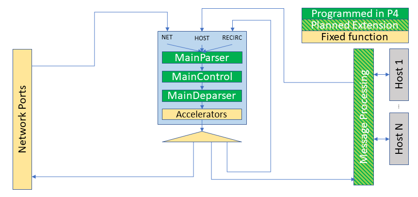
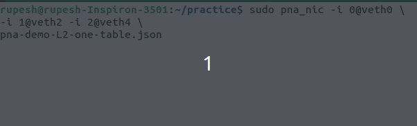
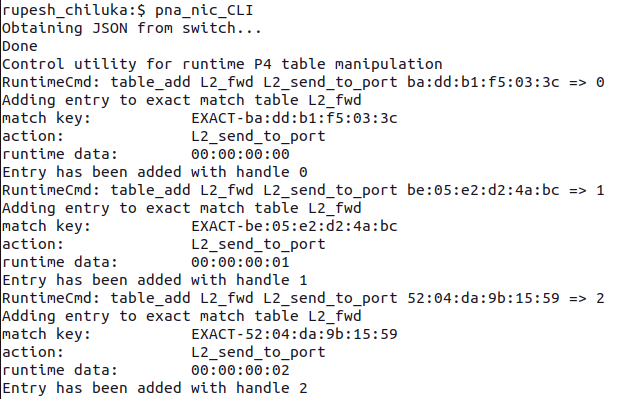
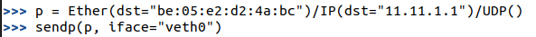
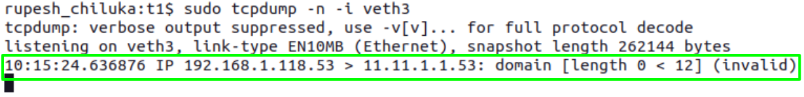

# BMv2 PNA Support
**Contributor**: Rupesh Chiluka ([@rupesh-chiluka-marvell])

**Mentors**: Bili Dong ([@qobilidop]), Hari Thantry ([@thantry])

[@rupesh-chiluka-marvell]: https://github.com/rupesh-chiluka-marvell
[@qobilidop]: https://github.com/qobilidop
[@thantry]: https://github.com/thantry

## Table of Contents
- [BMv2 PNA Support](#bmv2-pna-support)
  - [Table of Contents](#table-of-contents)
  - [Abstract](#abstract)
  - [Goals](#goals)
  - [Results](#results)
  - [Demo](#demo)
  - [Implementation details](#implementation-details)
    - [New PNA NIC target in BMv2](#new-pna-nic-target-in-bmv2)
    - [P4C backend for the new BMv2 PNA NIC target](#p4c-backend-for-the-new-bmv2-pna-nic-target)
  - [Future Work](#future-work)
    - [Standard PNA Features (Implemented)](#standard-pna-features-implemented)
    - [Standard PNA Features (Yet to be Implemented)](#standard-pna-features-yet-to-be-implemented)
    - [Experimental PNA Features (Yet to be Implemented)](#experimental-pna-features-yet-to-be-implemented)

## Abstract

As the P4 use cases on the NIC side increase, so does the need for a P4 simulator that supports [Portable NIC Architecture (PNA)](https://p4.org/p4-spec/docs/PNA-v0.7.html). Currently, the BMv2 simulator only supports the v1model and [Portable Switch Architecture (PSA)](https://p4.org/p4-spec/docs/PSA-v1.2.html) specifications. This project aims to integrate a minimal core subset of the PNA into the BMv2 and the P4C. The PNA Architecture Block Diagram is shown in below:

  

## Goals
- Create a new target in BMv2 supporting the core subset of PNA
- Create a new P4C backend for the new BMv2's PNA NIC target
- Design test cases to ensure the PNA NIC target is working

## Results
The project successfully creates a new target in BMv2 to support PNA and a corresponding backend in P4C. A test case is implemented to ensure the new PNA NIC target can forward the packets between interfaces.

## Implementation details

### New PNA NIC target in BMv2
Relevant PRs:
- https://github.com/p4lang/behavioral-model/pull/1255
- https://github.com/p4lang/behavioral-model/pull/1262
- https://github.com/p4lang/behavioral-model/pull/1263
- https://github.com/p4lang/behavioral-model/pull/1265

Created a basic PNA NIC target with basic externs (Meter, Counter, Register, etc). A test case was added to check whether the new PNA NIC could load the P4C-generated PNA JSON file. Makefiles are adjusted to build the new PNA NIC target while building the bmv2 repository. Just follow the build commands mentioned in the repository.

Resultant Binary: `pna_nic`

### P4C backend for the new BMv2 PNA NIC target
Relevant PR: https://github.com/p4lang/p4c/pull/4729

Created a new p4c backend for the PNA NIC target.

Since both PSA_SWITCH and PNA_NIC compiler backends have a lot of common code, I created a common code base and called it "portable_common." The PSA and PNA components will now inherit from the "portable" components.

Merged the `ProgramStrucutre` and `CodeGenerator` classes into one class.

Included the PNA specification file from [p4lang/pna/pna.p4](https://github.com/p4lang/pna/blob/main/pna.p4).

Makefiles are adjusted to build the new P4C backend for the PNA NIC target while building the P4C repository. Just follow the build commands mentioned in the repository.

Resultant Binary: `p4c-bm2-pna`

## Demo

- Created a similar virtual interface setup as mentioned in [this tutorial](https://hikingandcoding.com/2019/09/17/getting-started-with-p4/).

- The [pna-demo-L2-one-table.p4](https://github.com/p4lang/pna/blob/main/examples/pna-demo-L2-one-table.p4) program from `p4lang/pna` repository is used to test the new PNA NIC target.

- Compile `pna-demo-L2-one-table.p4` using `p4c-bm2-pna` binary.
  - `p4c-bm2-pna pna-demo-L2-one-table.p4 -o pna-demo-L2-one-table.json`

- To start the `pna_nic` target:

  

- start the `pna_nic_CLI` and populate the `L2_fwd` table mentioned in the P4 program using the below example (or your own) data:
  - `table_add L2_fwd L2_send_to_port ba:dd:b1:f5:03:3c => 0`
  - `table_add L2_fwd L2_send_to_port be:05:e2:d2:4a:bc => 1`
  - `table_add L2_fwd L2_send_to_port 52:04:da:9b:15:59 => 2`

  

- Send the Packets from one interface and listen on another interface. Example:

  

  

## Future Work

This project integrates a minimal core subset of the PNA into BMv2 and P4C. Many PNA use cases have yet to be implemented in the BMv2.

### Standard PNA Features (Implemented)
- Basic Forwarding
- Counters
- Meters
- Hash
- Internet Checksum
- Random

### Standard PNA Features (Yet to be Implemented)
- Recirculation
- Dropping
- Differentiate between Host and Network Interfaces

### Experimental PNA Features (Yet to be Implemented)
- IPSec Encrypt/Decrypt
- Large Receive Offload (LRO)
- Receive Side Scaling (RSS)
- TCP segmentation offloading (TSO)
