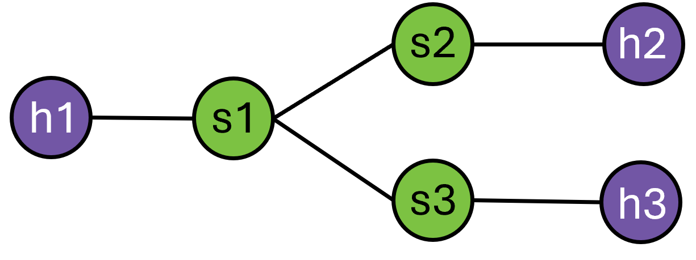
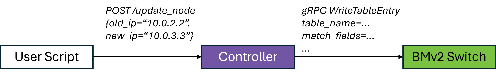
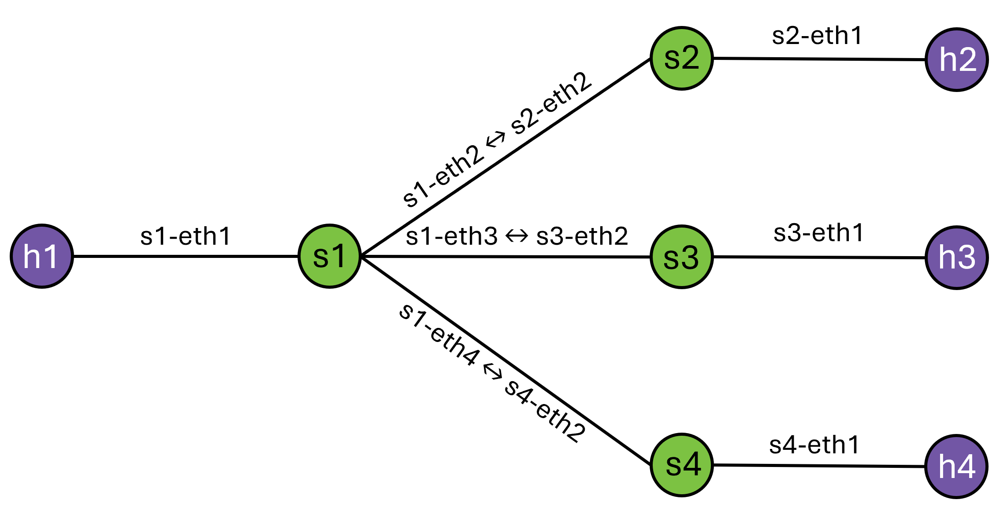
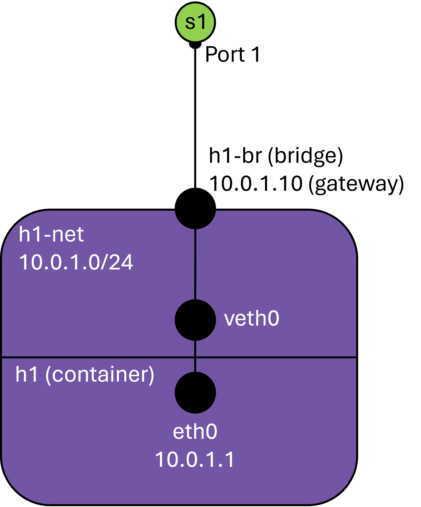
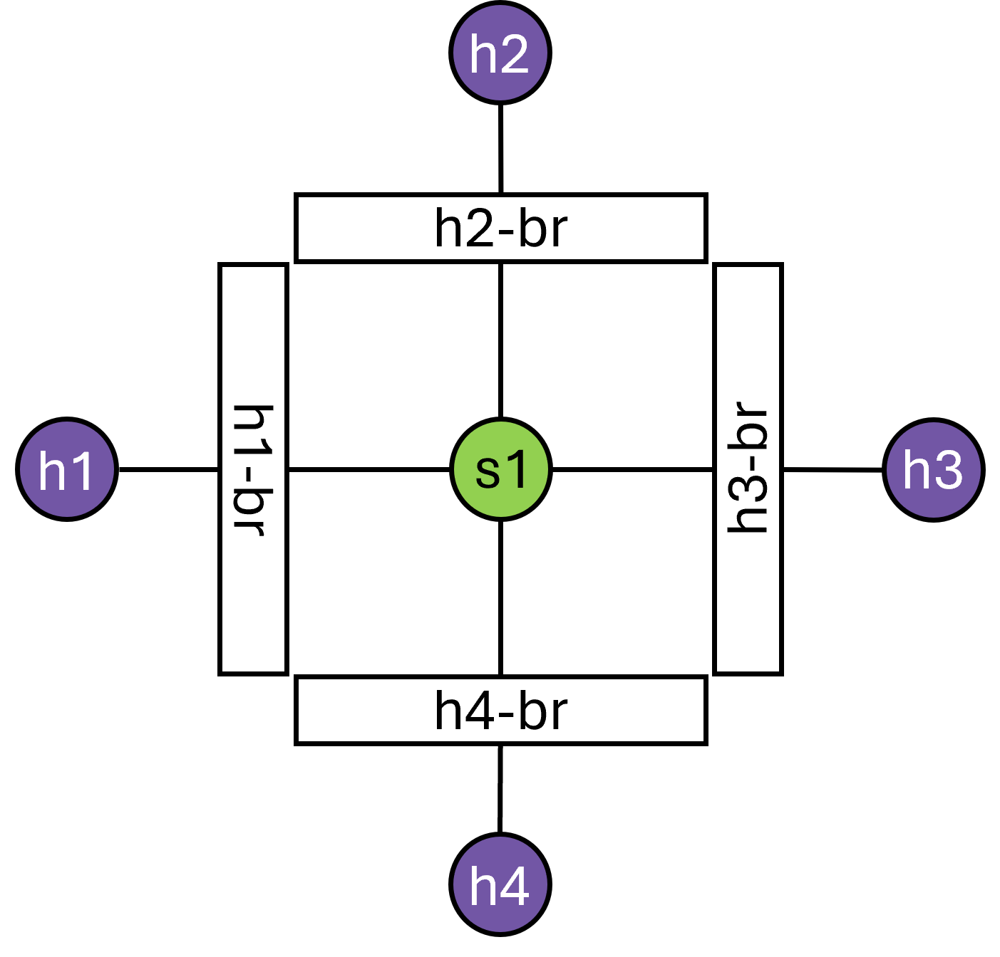
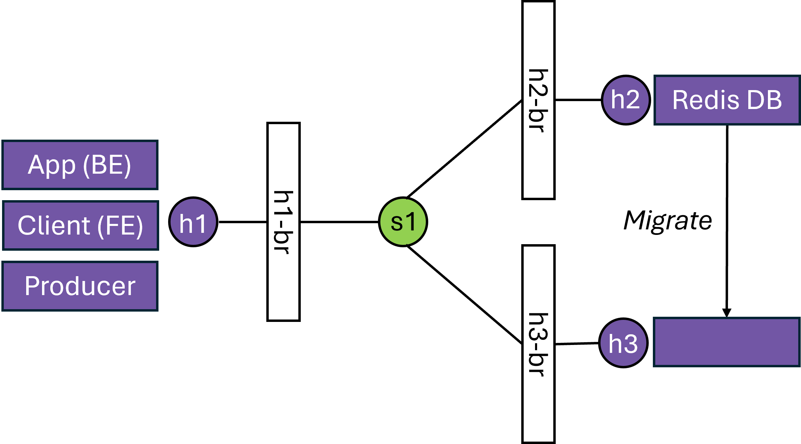

# P4-Enabled Container Migration in Kubernetes
**Contributor**: Stanislav Kosorin ([@stano45])

**Mentors**: Radostin Stoyanov ([@rst0git]), Davide Scano ([@Dscano])

[@rst0git]: https://github.com/rst0git
[@stano45]: https://github.com/stano45
[@Dscano]: https://github.com/Dscano

## Table of Contents
- [P4-Enabled Container Migration in Kubernetes](#p4-enabled-container-migration-in-kubernetes)
  - [Table of Contents](#table-of-contents)
  - [Abstract](#abstract)
  - [Goals](#goals)
  - [Results](#results)
  - [Links](#links)
  - [Implementation details](#implementation-details)
    - [Initial prototype](#initial-prototype)
    - [Controller](#controller)
    - [TCP Checksum](#tcp-checksum)
    - [Linux Networking](#linux-networking)
    - [Containerizing hosts](#containerizing-hosts)
    - [Containerizing BMv2 switches](#containerizing-bmv2-switches)
    - [Redis container migration](#redis-container-migration)
    - [The Kubernetes network model](#the-kubernetes-network-model)
    - [Initial Kubernetes integration](#initial-kubernetes-integration)
  - [Future Work](#future-work)

## Abstract

Kubernetes has recently introduced a container checkpoint/restore (C/R) feature to enable the creation of stateful snapshots for running containers. This feature allows containers to be restarted from checkpoints in different pods, enabling use cases such as live migration of microservices. However, preserving established TCP connections during migration is challenging because Kubernetes dynamically allocates IP addresses to Pods in the cluster. As a result, the restored container will run with a different IP address after migration, while clients will continue to send packets to the old IP address. This project aims to address this problem by developing a P4-based load balancer that keeps track of established TCP connections and routes application traffic to the correct IP address after container migration.

## Goals
- Write a load balancer program in the P4 language that forwards TCP packets to hosts while preserving established TCP connections during container migration
- Develop a P4Runtime controller that automatically updates the packet forwarding rules during container migration
- Explore the integration of a P4 software switch with Kubernetes clusters
- Design evaluation experiments that demonstrate the preservation of established TCP connections during container migration

## Results
The project successfully demonstrates the application of the P4 language to address the challenge of preserving established TCP connections during container migration, even when IP addresses change. Several migration scenarios were implemented using the BMv2 switch to illustrate the effectiveness of this approach.

Key contributions include:
1. **Process migration:** Demonstrating how TCP connections can be maintained during migration of Linux processes from one network namespace to another.
2. **Container migration with a BMv2 switch:** Demonstrating migration of containers between Pods while preserving TCP connections.
3. **Container migration with a fully containerized setup:** The scenario above has been extended to include the BMv2 switch running in a container.
4. **Container Migration of an In-Memory Database:** Within a more complex system, this example highlights the successful migration of a containerized in-memory database while preserving two established TCP connections.
5. **Kubernetes integration using kube-router:** A use case was explored involving kube-router, with plans to replace it with BMv2 in future work.

## Links
All of the artifacts developed within this project are available in the following GitHub repository: https://github.com/stano45/p4containerflow

## Implementation details
This project was implemented in small, incremental steps, from simple process migration using [CRIU](https://criu.org/Main_Page) to an integration with [Kubernetes](https://kubernetes.io/). We described each step in this document by outlining the key changes, identifying challenges faced during development, and discussing possible solutions. In each step, we linked relevant code and resources that could be helpful for anyone facing similar challenges.

### Initial prototype
Relevant PR: https://github.com/stano45/p4containerflow/pull/1

The P4 organization already provides convenient scripts to build a virtual machine (VM) which includes all relevant P4 packages. This [VM](https://github.com/p4lang/tutorials/tree/master/vm-ubuntu-24.04) runs [Ubuntu 24.04](https://releases.ubuntu.com/noble/) and includes packages such as:
- [The BMv2 software switch](https://github.com/p4lang/behavioral-model),
- [The p4 compiler (p4c)](https://github.com/p4lang/p4c),
- [mininet](https://github.com/mininet/mininet),
- [p4runtime (python library for interacting with switches)](https://github.com/p4lang/p4runtime).

Furthermore, we reused the load_balance exercise from the [p4lang/tutorials](https://github.com/p4lang/tutorials) repository. This is a simple load balancer, which hashes connections based on the source IP, source port, destination IP, destination port, and protocol into 2 buckets, which represent hosts. The output of this hash is 0 or 1, which is then used to index the target host (`h2` or `h3`) using the `ecmp_nhop` table.

The following diagram shows the initial network topology, with three hosts (`h1`, `h2`, `h3`) and three switches (`s1`, `s2`, `s3`), where `s1` is the load balancer:

<picture>
  <source media="(prefers-color-scheme: dark)" srcset="assets/simple_lb_light.png">
  <source media="(prefers-color-scheme: light)" srcset="assets/simple_lb_dark.png">
  
</picture>

### Controller
Relevant PRs:  
- https://github.com/stano45/p4containerflow/pull/3
- https://github.com/stano45/p4containerflow/pull/5 
- https://github.com/stano45/p4containerflow/pull/16
- https://github.com/stano45/p4containerflow/pull/17 

Next, we want to be able to change the hosts during runtime. We built a Python-based controller, utilizing the p4runtime library, and further Python utils from the [p4lang/tutorials](https://github.com/p4lang/tutorials) repository. Furthermore, we set up a simple flask HTTP server with three endpoints: `/insert_node`, `/update_node`, and `/delete_node`. These endpoints insert, update, and delete entries in the `ecmp_nhop` table. 

The controller also keeps track of the match-action table state, by a target IP -> index mapping. The index mapping corresponds to the value in the `ecmp_nhop` table. This makes it more efficient to look up the index of a specific IP in the table, without the need to fetch table state from the switch on each update request.

<picture>
  <source media="(prefers-color-scheme: dark)" srcset="assets/controller_light.png">
  <source media="(prefers-color-scheme: light)" srcset="assets/controller_dark.png">
  
</picture>

During this stage, we faced minor issues:
- There is a distinction between `INSERT` and `MODIFY` operations when updating table entries. The `INSERT` operation will not work when trying to modify an existing table entry. Therefore, we modified the utils from p4lang/tutorials to correctly set the operation type in the request ([see code](https://github.com/stano45/p4containerflow/pull/3/files#diff-4f9b1842d1e340173e930bf32157910c84b4c896e1530e48d7995f97b3425e57)).
- Initially, the controller initiates a connection to each switch in order, e.g. `s1`, then `s2`, etc. To be able to perform write operations, the switch needs to be set as master, by performing the master arbitration update. Therefore, when we wrote the initial match-action tables from the `.json` runtime files in order of switch id and then attempted to update `s1` during runtime, we encountered an error, that this controller is not set as the master. A simple fix is to perform a master arbitration update again, or simply program `s1` as the last switch on initialization.
Later in the project, we modified the controller to accept a `.json` configuration for switches. This configuration allows for an arbitrary number of switches and flexible programming of each switch ([see PR](https://github.com/stano45/p4containerflow/pull/16)).
- The BMv2 switches take time to initialize and start up the gRPC server. During this period, the controller cannot initiate a connection with the switches. We solved this by simply waiting 2 seconds before starting the controller ([see code](https://github.com/stano45/p4containerflow/blob/880844bb9fd43b5629bafe5e175f7a4285343e8d/examples/redis/Makefile#L9)). A more practical solution would be to implement a retry mechanism in the controller code when initiating a switch connection.

### TCP Checksum
Relevant PR: https://github.com/stano45/p4containerflow/pull/6

At this point, we have a working load balancer that forwards traffic to one of two hosts. We are also able to update the load balancer node IPs using the controller. However, the load balancer in this state only supports traffic in the direction of the target hosts, while traffic from the hosts back to the client is not properly handled.

To support TCP connections, the following needs to be adjusted:
1. Rewrite the IP address of response packets. This is necessary, since the load balancer also has an IP address, and packets returning from target hosts would not be recognized as being a part of the same TCP connection.
2. Recompute the checksum for TCP packets, in addition to the IPv4 checksum.

Rewriting the source was relatively straightforward. Using p4’s match-action tables, we inserted an entry to the `ecmp_group` table, matching on the client’s IP (fixed at `10.0.1.1` in this example, [see code](https://github.com/stano45/p4containerflow/blob/a270c9bb9448d7952e0811c4d0636a79ee64113e/controller/switch_controller.py#L65)) and wrote an action to rewrite the source address to the switches’ IP ([see code](https://github.com/stano45/p4containerflow/blob/4846084c3239aeeac9944526f0bd917a79c8aa0f/load_balancer/load_balance.p4#L124)). 

Calculating the TCP checksum correctly was a bit trickier. The key issues to look out for are properly parsing TCP headers ([see code](https://github.com/stano45/p4containerflow/blob/4846084c3239aeeac9944526f0bd917a79c8aa0f/load_balancer/load_balance.p4#L30)) and passing headers to the hash function in the right order (see [code](https://github.com/stano45/p4containerflow/blob/4846084c3239aeeac9944526f0bd917a79c8aa0f/load_balancer/load_balance.p4#L218) and [p4 forum thread](https://forum.p4.org/t/checksum-calculation-when-adding-payload-to-syn-packet/96/4)).  

During this stage, I found Wireshark to be a very useful tool, since it verifies the checksum of each TCP packet. If the checksum is calculated incorrectly, this will be indicated in the packet trace. This can help test any changes to the checksum quickly, without being left to wonder why packets are being dropped. A similar functionality is provided by the tcpdump CLI.

### Linux Networking
Relevant PR: https://github.com/stano45/p4containerflow/pull/8/

The initial prototype relies on mininet to build a network using virtual interfaces and network namespaces. Mininet is a useful tool for rapidly building and evaluating network topologies. However, since the goal is to integrate this system into Kubernetes, mininet is a limitation. 
We decided to rebuild the same topology using the Linux networking stack. The main building blocks of this step are:
- Network namespaces (netns),
- Virtual ethernet pairs (veth pairs).

A network namespace is a fundamental building block of Linux networking that allows for the creation of isolated network environments. Each namespace has its own set of network interfaces, routing tables, and iptables rules, making it possible to simulate multiple network environments on a single host. 

Virtual ethernet pairs can be used to create virtual interfaces, and automatically link them together. It is possible to “place” one half of the pair inside a network namespace, to simulate a link to a separate network. The other half of the veth pair acts as a gateway for the network living in the namespace.

Using netns, veth pairs, and the iproute2 suite to set MAC and IP addresses of virtual interfaces, we rebuilt the mininet topology on the Linux Networking Stack. This is done in the form of bash scripts ([see code](https://github.com/stano45/p4containerflow/blob/998d1dcb70cb97cee3636877cc68cb296cdc32b6/examples/process_migration/build.sh)). 

The following diagram shows the created topology, including the virtual interfaces:

<picture>
  <source media="(prefers-color-scheme: dark)" srcset="assets/linux_network_light.png">
  <source media="(prefers-color-scheme: light)" srcset="assets/linux_network_dark.png">
  
</picture>

Setting up a complex virtual network topology is not straightforward. We outlined key challenges we faced during implementation:

- It is important to set the gateway address of each of the network namespaces, followed by static ARP entries. This ensures the routing works properly.
- The number of virtual interfaces can grow quite large when building a complex network topology like ours. This is just a tip for anyone attempting the same: Whenever you write a script to build a network element (veth pair, netns), make sure to immediately write a script to tear it down the same way. Always a new interface/namespace, and then tear it down. It is easy to forget this part, and then have to manually tear down the network with additional effort.

### Containerizing hosts
Relevant PR: https://github.com/stano45/p4containerflow/pull/9

After everything was running properly on a virtualized network, we immediately recognized that the next step would be to start containerizing components. Container management tools (such as [Podman](https://podman.io/)) create network namespaces and wire them up using veth pairs in a very similar way as we did in the previous step.

Specifically, Podman uses the netavark backend for virtual networking. Each network is a separate network namespace, and each container in the network is connected to a network bridge. The network has a reserved IP address range, and the network bridge acts as the gateway. Each container assigned to a network gets its own IP.

The following diagram shows the network topology of a single host and the connection of the network to a switch port:

<picture>
  <source media="(prefers-color-scheme: dark)" srcset="assets/container_interface_light.png">
  <source media="(prefers-color-scheme: light)" srcset="assets/container_interface_dark.png">
  
</picture>

We wrote a script to create a network and a pod for each container. A pod is a group of containers with a shared IP address. This is also the case within the Kubernetes network model. We built a container image using the TCP server executable from the previous steps. Analogously, we built a client image. 

There is no explicit link from the network bridge to the switch port. We ensured correct routing by setting the corresponding switch port as the default gateway for each host and inserted a static ARP entry. This way, the container immediately sent all traffic (outside its network) to the switch port’s MAC address, and the switch handled all further routing. This was repeated for all hosts to mimic the previous topology

However, this approach is not ideal, since the IP route and the static MAC address have to be inserted inside the container. This is not possible with most containers, since most only include the required binaries and no networking packages, such as iproute2. Therefore, a further configuration of each container would be necessary, which might not be scalable in real-world scenarios. We did not address this problem, as this is only an intermediate step in the project, and the topology will change in the next steps.

Furthermore, when setting up the routing, we encountered a strange issue: each established TCP connection would receive an `RST` packet from some interface and terminate. If you ever encounter such an issue in your experiments, it might be easier to check the following:
1. Are there IP table rules that drop TCP packets anywhere? This would mean the kernel sends the TCP `RST` from that interface.
2. Is the switch interface in promiscuous mode? Sometimes, when a packet is addressed at an interface, the kernel sends a `RST` packet, since there is no process listening on that interface.

This issue can be solved by blocking TCP reset packets generated by the interface. 

### Containerizing BMv2 switches
Relevant PR: https://github.com/stano45/p4containerflow/pull/10

After containerizing the hosts, we also decided to containerize the BMv2 switches. We simplified the topology to only include one switch, which uses the host network bridges as ports. These network bridges act as gateways for the Podman networks created in the previous step.

For simplicity, the switch container runs on the host network. The container image used is docker.io/p4lang/p4c image, which includes the BMv2 binary.

The following diagram shows the network topology, which consists of 4 Podman networks interfaced by bridges, connected to a single BMv2 switch running in a container, but on the host network:

<picture>
  <source media="(prefers-color-scheme: dark)" srcset="assets/container_network_light.png">
  <source media="(prefers-color-scheme: light)" srcset="assets/container_network_dark.png">
  
</picture>

### Redis container migration
Relevant PR: https://github.com/stano45/p4containerflow/pull/18 

To demonstrate container migration on the network topology we created, we set up a system with multiple components:
An in-memory database (Redis) instance running on host 2 (`h2`),
A backend application (App) running on host 1 (`h1`), exposing an endpoint to fetch data from the Redis DB, additionally containing the uptime of the Redis instance and number of connected clients,
A client, also running on `h1`, that periodically fetches data from the BE and prints them in the console (simulating an oversimplified frontend application),
A producer, also running on `h1`, periodically fetches a numerical ‘counter’ entry from the Redis DB, increments it by one, and updates the entry in the database.

<picture>
  <source media="(prefers-color-scheme: dark)" srcset="assets/redis_light.png">
  <source media="(prefers-color-scheme: light)" srcset="assets/redis_dark.png">
  
</picture>

After deploying this system, we can observe the counter being periodically incremented by the producer. We perform a migration of the Redis DB from host 2 to host 3, the same way as in the previous examples, and observe little to no downtime from the client’s perspective. 

We confirm that the migration has been successfully performed, since:
traffic from the producer and the app is correctly routed to `h3` instead of `h2`,
the counter does not reset, confirming data consistency,
the uptime of the Redis instance does not reset, confirming the instance previously running on `h2` is now running on `h3`,
the connected clients count stays at 2, confirming both the app’s and producer’s TCP connections to the Redis DB have been preserved.

### The Kubernetes network model

Before we dive into the [Kubernetes](https://kubernetes.io/) integration, it is important to understand the Kubernetes network model, and how load balancing is handled in practice.
This is how Kubernetes networking is described in the [official documentation](https://kubernetes.io/docs/concepts/services-networking/):

> Every Pod in a cluster gets its own unique cluster-wide IP address (one address per IP address family). This means you do not need to explicitly create links between Pods and you almost never need to deal with mapping container ports to host ports.
This creates a clean, backwards-compatible model where Pods can be treated much like VMs or physical hosts from the perspectives of port allocation, naming, service discovery, load balancing, application configuration, and migration.

This model is similar to what we have deployed in previous examples, where each pod was assigned a unique IP address, while the pod network interface is often a bridge.  However, the pod IP is allocated by Kubernetes. We will discuss the implications of this in the next section.

Furthermore, it is important to understand how load balancing is handled in Kubernetes. As always, there are multiple options. Firstly, it is possible to create a `Service` of type `LoadBalancer`. The load balancer is implemented by the cloud provider and is usually a proprietary component, which cannot be deployed locally without extra effort.

Therefore, we evaluated various open source solutions to Kubernetes  to assess how we can approach the integration of the BMv2 switch into the Kubernetes ecosystem.

Firstly, we looked at [MetalLB](https://metallb.universe.tf/), which provides a load balancer implementation for bare metal clusters. Using MetalLB in layer 2 mode, all service traffic is routed to a single node, where `kube-proxy` spreads the traffic to pods. This model could be potentially extended by integrating a BMv2 switch running our P4 load load balancer program.

Secondly, Kubernetes provides a Gateway API implementation that includes protocol-specific Route resources such as [TCPRoute](https://gateway-api.sigs.k8s.io/guides/tcp/) allowing to forward a TCP stream to a specified backend. Since this is similar to the goal of this project, a potential approach could be to modify this functionality to route traffic to a BMv2 switch.

Lastly, it is possible to build a solution similar to [kube-router](https://github.com/cloudnativelabs/kube-router). The kube-router solution is deployed on the cluster as a `DaemonSet`, which means that all nodes run a copy of the pod (see the [Kubernetes docs](https://kubernetes.io/docs/concepts/workloads/controllers/daemonset/) for more information). Kube-router uses the standard Linux networking stack (as discussed in a previous section), which makes it more straightforward to use than solutions using SDN or overlays.

Because of the simplicity of the kube-router solution, and the potential ease of replacing it with a controller using the BMv2 software switch, we decided to first deploy kube-router, and then look at possibilites of replacing it with a custom solution.

### Initial Kubernetes integration
Relevant PRs:
- https://github.com/stano45/p4containerflow/pull/21
- https://github.com/stano45/p4containerflow/pull/22

As a first step to start with the Kubernetes integration, we created a single-node cluster using kubeadm. To handle networking, we deployed a `DaemonSet` on the node running kube-router to load-balance traffic between pods. Furthermore, we deployed a simple `http-server` service, running in 2 pods. There is one container running in each pod, which accepts requests, holds them for a couple of seconds, and then sends a response.

Migration within of a container running inside a Kubernetes pod requires multiple steps:
1. Calling the kubelet checkpoint API to create a container checkpoint,
2. Building a container image from the checkpoint,
3. Pushing the container image to a container registry (local or hosted),
4. Editing manifests to deploy this container image,
5. Applying the manifest to restore the container.

However, there are multiple issues with this approach, which will need to be addressed in future development of the project:
1. Restoring a container with a new IP address in Kubernetes presents a "chicken or the egg" problem. In our approach, the checkpoint is modified with the new IP address (similar to [scripts/edit_files_img.py](https://github.com/stano45/p4containerflow/blob/998d1dcb70cb97cee3636877cc68cb296cdc32b6/scripts/edit_files_img.py)), but Kubernetes allocates the IP address during restore. This could potentially be handled by running an [init container](https://kubernetes.io/docs/concepts/workloads/pods/init-containers/) in the target pod to make Kubernetes assing an IP address before container restore.
2. The "Connection reset by peer" error always occurs after restore because checkpointing is performed for a container in a network namespace allocated to a Pod. There is no mechanism currently to prevent the Linux kernel from closing the TCP connection when a new packet is received from the client while the checkpointed container is not running. This problem could be solved by attaching [CRIU action scripts](https://criu.org/Action_scripts) to [Kubernetes lifecycle events](https://kubernetes.io/docs/tasks/configure-pod-container/attach-handler-lifecycle-event/) to lock the network and prevent the Kernel from sending a `RST` packet to the client.
3. The current checkpoint/restore mechanism in Kubernetes was primarily designed for forensic analysis and unsuitable for live migration. In particular, it takes significant time to create a checkpoint archive, upload it to a container registry, and restore the container in a new Pod. This results in significant downtime. Within future work, there is room to optimize this process in multiple places.

## Future Work
While this project presents multiple experiments showcasing container migration with established TCP connections, there is an additional effort required to utilize the P4 load balancer within Kubernetes. Specifically, the above-described example with kube-router should be modified to utilize a BMv2 switch for load balancing. This approach requires writing a Kubernetes controller that interacts with the BMv2 switch.

Furthermore, it would be particularly useful to deploy a multi-node Kubernetes cluster and run the load balancer on a P4-programmable switch, such as Intel Tofino to assess the feasibility of this approach in a realistic scenario. Similarly, such an evaluation could be performed using SmartNICs such as the NVIDIA BlueField DPU.
