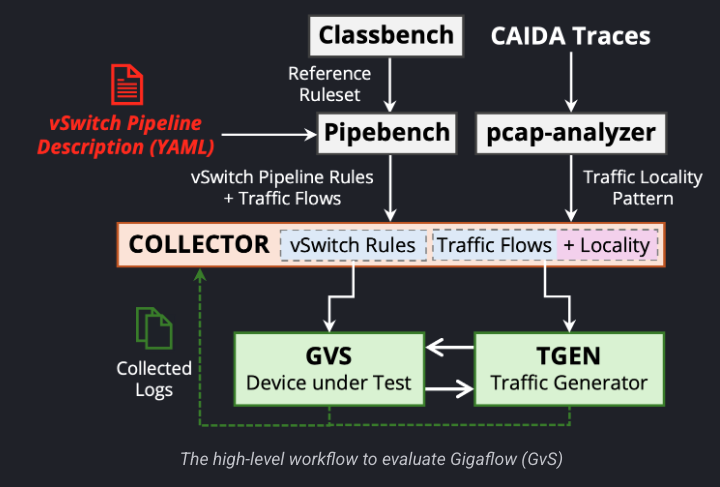

# Accelerating OVS with Gigaflow: A Smart Cache for SmartNICs

**Contributor**: Advay Singh ([@AdvaySingh1])

**Mentors**: Annus Zulfiqar ([@annuszulfiqar2021]), Ali Imran ([@ALI11-2000]), Davide Scano ([@Dscano]), Muhammad Shahbaz ([@msbaz2013])

[@AdvaySingh1]: https://github.com/AdvaySingh1
[@annuszulfiqar2021]: https://github.com/annuszulfiqar2021
[@ALI11-2000]: https://github.com/ALI11-2000
[@Dscano]: https://github.com/Dscano
[@msbaz2013]: https://github.com/msbaz2013

---

## Executive Summary

This project successfully extends the Gigaflow Virtual Switch (GVS) (find out more [here](https://gigaflow-vswitch.github.io/)) framework to enable hardware acceleration on SmartNICs, specifically targeting NetFPGA platforms. The work bridges the gap between software-defined networking (SDN) and hardware acceleration by implementing a complete pipeline from P4 code compilation to bitstream deployment and runtime rule management.

---

## Enhanced Gigaflow Virtual Switch (GVS)

The core contribution of this project is the extension of the Gigaflow Virtual Switch to support hardware acceleration through SmartNIC offload. The gvs-offload maintains full backward compatibility with the software-only implementation while adding comprehensive hardware acceleration capabilities.

**Repository**: [gvs-offload](https://github.com/AdvaySingh1/gvs-offload/tree/main)

### Architecture and Design

The gvs-offload implements a hybrid software-hardware architecture where the Gigaflow cache can operate in three distinct modes:

1. **Software-only Mode**: Traditional CPU-based packet processing with the original Gigaflow cache implementation
2. **Full Hardware Mode**: Complete pipeline execution on SmartNIC with minimal CPU involvement

The following are the additions to the original GVS:

### Hardware Integration Layer

The hardware integration layer provides a unified abstraction for different SmartNIC platforms. The implementation includes:

**SDNet Driver Integration**: The gvs-offload integrates with Xilinx's SDNet IP through custom drivers that handle rule installation, table updates, and statistics collection. The SDNet files included in the project are auto-generated when the bitstream is created through the Vivado software compilation process.

**Rule Translation Engine**: Converts high-level Gigaflow cache policies into hardware-compatible table entries and match-action rules that can be programmed into the P4 pipeline.

### Integration with Open vSwitch

The gvs-offload maintains full compatibility with OVS through the existing datapath interface while extending it with hardware acceleration flow offload APIs. The integration supports:

---

## Supporting Components

### Additional Orchestrators
- **MLX Orchestrator**: Initial framework for MLX NIC integration with traffic generation and performance benchmarking utilities
  - **Repository**: [MLX Orchestrator](https://github.com/AdvaySingh1/gigaflow-orchestrator/tree/main)
- **NetFPGA Orchestrator**: Kernel-mode integration with comprehensive test suite for NetFPGA platforms, providing rule installation APIs and pipeline validation
  - **Repository**: [NetFPGA Orchestrator](https://github.com/AdvaySingh1/gigaflow-orchestrator-p4sdnet-offload)
- **P4 Behavioral Simulation**: Pre-deployment testing framework using Vivado simulation tools for comprehensive P4 code validation
  - **Repository**: [P4 Behavioral Simulation](https://github.com/AdvaySingh1/p4c-sdnet-Behavioral-Sim)

### NetFPGA Hardware Offload
- **P4 Implementation**: Complete P4 pipeline for NetFPGA AU250 with Vivado compilation and bitstream generation
  - **Repository**: [P4 Implementation (NetFPGA)](https://github.com/AdvaySingh1/NetFPGA-au250-Offload)
- **Shell Integration**: NetFPGA AU250 shell integration with P4SDNet IP configuration and wrapper logic
- **Hardware Optimization**: Resource optimization and wire-speed packet processing capabilities

---

## Project Workflow

1. This image shows the main workflow of the project. Initially, P4 code was written and tested using the [P4 Behavioral Simulation](https://github.com/AdvaySingh1/p4c-sdnet-Behavioral-Sim). 
2. Then, the P4 code was compiled into a bitstream using Vivado and the [P4 Implementation (NetFPGA)](https://github.com/AdvaySingh1/NetFPGA-au250-Offload) repository. This compilation process also developed the SDNet driver integration for the gvs-offload.
3. The bitstream is then loaded onto the Xilinx AU250 card and the SDNet driver is probed to the kernel. Upon this, the test suite inside the [P4 Implementation (NetFPGA)](https://github.com/AdvaySingh1/NetFPGA-au250-Offload) repository was run for testing basic functionality of the hardware offload.
4. Following this, [GVS](https://github.com/AdvaySingh1/gvs) was modified to support the hardware offload. While the Gigaflow logic existed in the software-only mode, flow translation was introduced to translate high-level Gigaflow cache policies into hardware-compatible table entries and match-action rules that can be programmed into the P4 pipeline.
5. Finally, the [NetFPGA Orchestrator](https://github.com/AdvaySingh1/gigaflow-orchestrator-p4sdnet-offload) was developed to provide a unified interface for rule installation and pipeline management. This also included the development of a test suite to validate the functionality of the hardware offload.

The following is a sample diagram of the project setup:

## Technical Learning and Expertise Gained

Throughout this project, I gained hands-on experience with data center networking and hardware acceleration using P4 and FPGA-based frameworks. I worked with Vivado, P4-SDNet, and the NetFPGA shell to compile P4 programs into SDNet IP, which was then integrated into the NetFPGA platform to build an accelerated switch. On the software side, I extended Open vSwitch (OVS) through the Gigaflow Virtual Switch (GVS), which added a caching layer. This required designing match-action tables that handled wide keys and multiple header fields, making the table structures significantly more complex than simple L2/L3 lookups. I also used DPDK in the software-offload design to enable high-performance packet processing with zero-copy techniques. Finally, I learned how to take P4-to-HDL pipelines through Vivado for synthesis and how to debug and validate the resulting hardware designs.

I also developed skills in AXI-Stream protocol design for building stream-processing pipelines with backpressure support, and in low-level driver development for PCI Express and DMA engine programming. In learning SDN principles, I worked with the OpenFlow protocol and configured flows directly, installing rules into the Gigaflow pipeline. A key aspect of the project was hardware–software co-design: I partitioned packet-processing algorithms by mapping software pipeline stages into Gigaflow table entries on hardware, optimizing for latency and throughput.

---

## Results and Performance

The hardware-accelerated Gigaflow implementation demonstrates significant performance improvements over software-only solutions. Currently in the process for final steps of benchmarking and testing, but initial results prior to pull request to GVS.

---

## Helpful Links

- **Gigaflow Project**: https://gigaflow-vswitch.github.io/ - Main Gigaflow project page
- **NextGarch Lab**: https://nextgarch-lab-ergp6tq.gamma.site/ - Laboratory environment that supported this project

## Acknowledgments

Special thanks to my mentors and the open-source community for their guidance and support throughout this GSoC project. The work builds upon the excellent foundation provided by the original GVS project and the NetFPGA community.