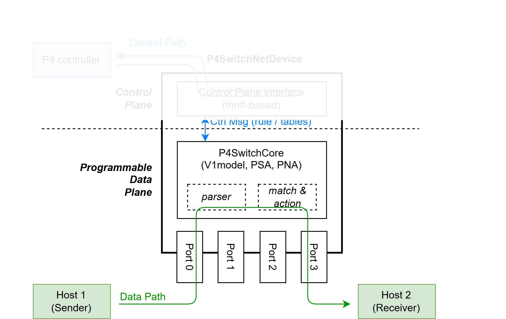
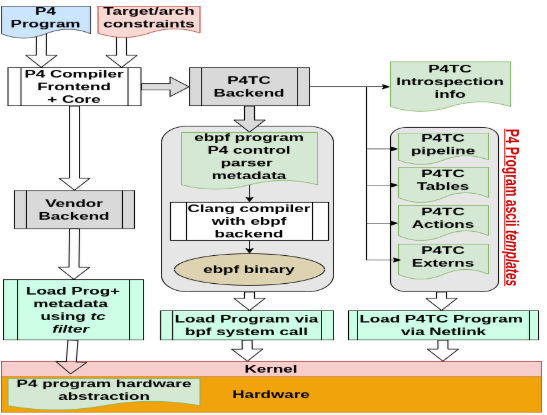
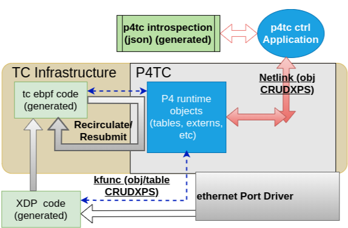
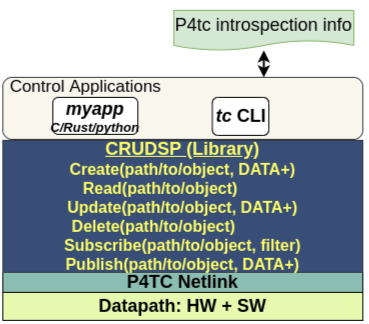
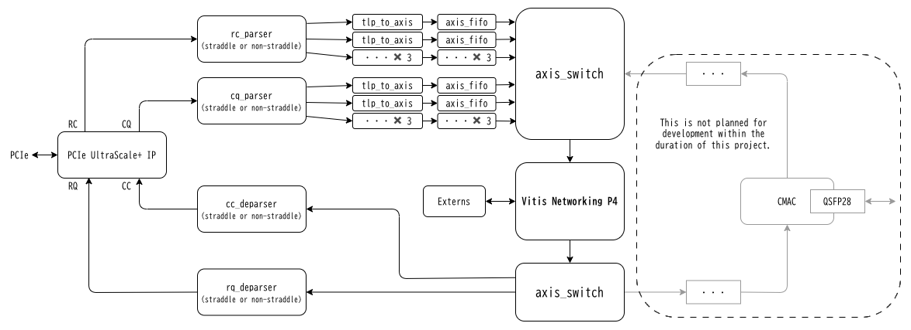
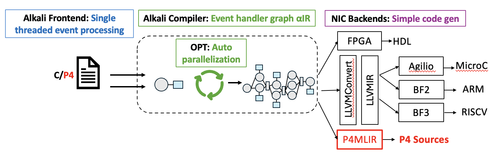
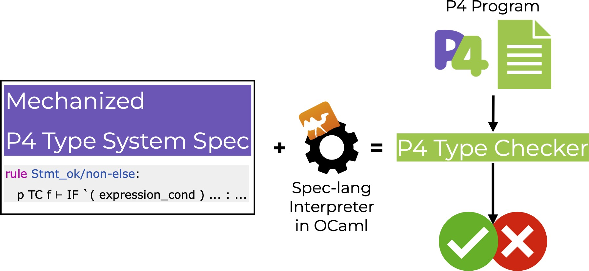
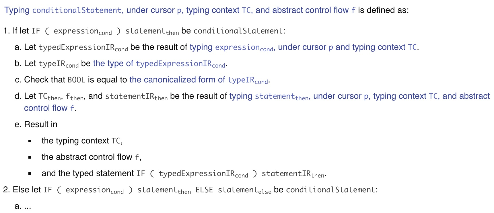

# P4 GSoC 2026 Ideas List

## Application process

Please check our [Contributor Guidance](/materials/contributor_guidance.md) for detailed instructions.

## Potential mentors

⭐ = available as primary mentor

1. ⭐ Jamal Hadi Salim ([@jhsmt](https://github.com/jhsmt), jhs@mojatatu.com)
2. ⭐ Jaehyun Lee ([@jaehyun1ee](https://github.com/jaehyun1ee), 99jaehyunlee@kaist.ac.kr)
3. ⭐ Jiaxin Lin ([@jxlin-lock](https://github.com/jxlin-lock), jiaxinl@cornell.edu)
4. ⭐ Mingyu Ma ([@Mingyumaz](https://github.com/Mingyumaz), mingyu.ma@tu-dresden.de)
5. ⭐ Matthew Lam ([@matthewtlam](https://github.com/matthewtlam), matthewtlam@google.com)
6. ⭐ Peng Qian ([@dawndusk0508](https://github.com/dawndusk0508), peng.qian@ox.ac.uk)
7. ⭐ Takeaki Oura([@iHalt10](https://github.com/iHalt10), ihalt10@icloud.com)
8. ⭐ Victor Nogueira ([@vbnogueira](https://github.com/vbnogueira), victor@mojatatu.com)
9. ⭐ Zhiyuan Guo ([@depctg](https://github.com/depctg), zhiyuang@cornell.edu)
10. Bili Dong ([@qobilidop](https://github.com/qobilidop), bilid@google.com)
11. Davide Scano ([@Dscano](https://github.com/Dscano), d.scano89@gmail.com)
12. Evangelos Haleplidis ([@evhalep](https://github.com/evhalep), ehalep@mojatatu.com)

## FAQ

Note: you = contributors, we = mentors.

**Q1: Some mentors are listed as primary mentor for multiple projects. How does that work?**

For the application phase, we'd like to present more options for you to choose from. Eventually, depending on the applications received, they will decide on at most 1 project to commit to as a primary mentor.

**Q2: What do our project difficulties mean?**

[diffi-easy]: https://img.shields.io/badge/Difficulty-Easy-green
[diffi-medium]: https://img.shields.io/badge/Difficulty-Medium-blue
[diffi-hard]: https://img.shields.io/badge/Difficulty-Hard-red

- ![diffi-easy]: Basic coding skills are sufficient.
- ![diffi-medium]: CS undergraduate level knowledge/skills are required.
- ![diffi-hard]: Deeper and more specialized knowledge/skills are required.

**Q3: Project sizes are specifided in hours. How many weeks do they correspond to?**

[size-s]: https://img.shields.io/badge/Size-90_hour-green
[size-m]: https://img.shields.io/badge/Size-175_hour-blue
[size-l]: https://img.shields.io/badge/Size-350_hour-red

- ![size-s]: 8 weeks
- ![size-m]: 12 weeks
- ![size-l]: 12 weeks

**Q4: Some projects have an "alternative qualification task" section. What does that mean?**

It means for that specific project, instead of the general qualification task, you shall complete the alternative qualification task described in that section.

**Q5: Some "alternative qualification task" section says "demonstrate your XYZ skills through contributions to". What does that mean?**

It means we expect you to have made relevant contributions in order to demonstrate your XYZ skills. In your applicaiton, please briefly describe your contributions, and attach related links (e.g. pull requests on GitHub).

## Project ideas

### Index

- Category: core P4 tooling
  - [Project 1: Modernizing the P4 Software Switch BMv2](#project-1)
- Category: exploratory P4 tooling
  - [Project 2: Realistic Traffic Manager and Queueing Architecture for P4 Switch Simulation in ns-3 (P4sim)](#project-2)
  - [Project 3: Polyglot P4TC: Python and Rust API Wrappers for Linux TC-based P4](#project-3)
  - [Project 4: PCIe TLP Communication Framework using P4](#project-4)
- Category: P4 research
  - [Project 5: Alkali-P4MLIR: Bridging P4 and SmartNICs Through MLIR Dialect Conversion Between Alkali IR and P4MLIR](#project-5)
  - [Project 6: Tutorial documentation for P4-SpecTec: A P4 specification mechanization framework](#project-6)
  - [Project 7: Integrating P4-based In-Network Machine Learning framework into P4Pi](#project-7)


---

### <a name='project-1'></a> Project 1: Modernizing the P4 Software Switch BMv2 [⤴️](#index)

**Basic info**

![diffi-medium] ![size-m]

- Potential mentors
  - Primary: Matthew Lam
  - Support: Bili Dong
- Skills
  - Required: Git, C++
  - Preferred: Bazel, P4
- Discussion thread: Github Issue Tracker, Zulip

**Alternative qualification task**
Presently, BMv2 can only be built with CMake. The goal is to modernize BMv2 and get it to build using Bazel 8.5.0 and deploy a Github workflow runs the unit tests for [simple_switch_grpc](https://github.com/p4lang/behavioral-model/tree/main/targets/simple_switch_grpc).

1. Add support for [Bazel 8.5.0](https://bazel.build/versions/8.5.0/run/build) to BMv2's simple_switch_grpc. An example P4 repository that uses Bazel is [P4Runtime](https://github.com/p4lang/p4runtime).
2. Create a Github workflow that caches, builds, and runs the unit tests. An example P4 repository that has a Github workflow set up is [P4C](https://github.com/p4lang/p4c/blob/7d367760701056cfa4fe0321f62914c0e79a6214/.github/workflows/ci-bazel.yml).

Create a PR under https://github.com/p4lang/behavioral-model.

**Project description**
BMv2 is a P4-based packet processor that has not been well maintained over the years due to lack of accessibility, slow builds/tests, lack of readability and complexity. One factor contributing towards the lack of accessibility is the difficulty of setting up the project prior to development.

There are many different enhancements to the repository that can be made including: 
* Extending support for BMv2 to build using Bazel
* Refactoring BMv2 to use Google style guide (https://google.github.io/styleguide/cppguide.html)
    * Absl Integration
    * Discourage exceptions (use status-based error propagation)
    * Use smart pointer over manual memory
    * Explicit constructors
    * Flatten the directory structure
    * Deprecating unused features
* Converting textual logs that manually track the packet through the pipeline into a structured and programmatic form (e.g. .proto) 
    * Can read more information [here](https://github.com/p4lang/gsoc/blob/main/2025/ideas_list.md#project-2). 


**Expected outcomes**
* Building BMv2 using Bazel will make it easier to set up, manage dependencies, and faster builds and tests
* Improving readability of BMv2 and reducing complexity of the repository
*  Structured packet trace outputs supported in BMv2.

**Resources**
* BMv2: https://github.com/p4lang/behavioral-model

---

### <a name='project-2'></a> Project 2: Realistic Traffic Manager and Queueing Architecture for P4 Switch Simulation in ns-3 (P4sim) [⤴️](#index)

**Basic info**

![diffi-hard] ![size-l]

- Potential mentors
  - Primary: Mingyu Ma 
  - Support: Davide Scano
- Skills
  - Required: C++, Git
  - Preferred: ns-3, P4, networking simulation
- Discussion thread: GitHub issue tracker, Zulip

**Alternative qualification task**

1. Skeleton dummy switch model in [ns-3](https://www.nsnam.org/)

Implement a minimal “skeleton” dummy switch model in ns-3 according to the current P4sim Plan A architecture:

- The switch should support a configurable number of ports.
- Each egress port should be able to attach a configurable [`Traffic Manager/traffic control`](https://github.com/p4lang/tutorials/tree/master/exercises/calc) module.
- The focus is on designing and implementing the port-level `NetDevice` structure in ns-3, rather than full packet processing logic.
- The implementation should be submitted to a public GitHub repository.

This skeleton switch will serve as the architectural starting point for the full project.

2. Running a P4 tutorial program on P4sim

Choose one of the following P4 tutorial exercises and make it runnable on P4sim:

- [`source_routing`](https://github.com/p4lang/tutorials/tree/master/exercises/source_routing)
- [`calc`](https://github.com/p4lang/tutorials/tree/master/exercises/calc)

The task includes:

- Writing the ns-3 simulation scripts and set up the network connnection,
- Adapting the P4 program to P4sim,
- Verifying correct functionality in the ns-3 simulation environment,
- Submitting the implementation as a pull request to the P4sim repository

**Project description**

Modern programmable switches based on P4 (e.g., Intel Tofino, Broadcom ASICs) employ sophisticated traffic management architectures, including multiple queues per output port, strict or weighted scheduling, and accurate modeling of packet transmission delays. However, current P4 switch simulators (P4sim, bmv2 and so on) rely on simplified designs, often using a single centralized traffic manager or a single queue per port.



*Figure 1: Architecture of the P4 switch model in P4sim.*

This project aims to redesign and extend the P4 switch model in ns-3 to provide a realistic traffic management architecture aligned with real hardware designs and the PSA (Portable Switch Architecture) model.


*Figure 2: Currents status and Plan A for switch model.*

The main idea is to move the traffic manager from a centralized pipeline into per-egress-port components, where each port maintains its own queue set and scheduler. The project will also integrate ns-3’s existing queueing and scheduling modules to avoid reimplementing well-tested mechanisms.

Key design aspects include:

- Per-port egress traffic managers instead of a single global manager.
- Configurable traffic manager, reuse the code of [Traffic Control Layer](https://www.nsnam.org/docs/models/html/traffic-control.html).
- Explicit modeling of packet serialization delay based on link bandwidth.
- Configurable ingress and egress pipeline processing delays.
- Full compatibility with PSA-style ingress/egress pipelines.

The new architecture will enable accurate evaluation of congestion, queue buildup, scheduling policies, and latency in networks using P4-programmable switches.

**Expected outcomes**

- A refactored P4 switch architecture in ns-3 with per-port traffic managers.
- Support for configurable Traffic control in egress ports.
- Configurable ingress and egress pipeline processing delays.
- Documentation and usage examples.
- Example simulation scenarios demonstrating queueing behavior and congestion effects.

**Resources and References**

- [P4sim](https://dl.acm.org/doi/10.1145/3747204.3747210) and [github](https://github.com/HapCommSys/p4sim)
- Intel / Barefoot Networks – [*Tofino Native Architecture (Public Version)*](https://raw.githubusercontent.com/barefootnetworks/Open-Tofino/master/PUBLIC_Tofino-Native-Arch.pdf)  
- P4 Switch Architecture and Traffic Manager ([P4 Workshop 2021 slides](https://opennetworking.org/wp-content/uploads/2021/05/2021-P4-WS-Vladimir-Gurevich-Slides.pdf))  
- Hot Chips 29 – [*P4 Programmable Switch Architecture Tutorial*](https://old.hotchips.org/wp-content/uploads/hc_archives/hc29/HC29.20-Tutorials-Pub/HC29.20.1-P4-Soft-Net-Pub/HC29.21.100-P4-Tutorial.pdf)  
  
---

### <a name='project-3'></a> Project 3: Polyglot P4TC: Python and Rust API Wrappers for Linux TC-based P4 [⤴️](#index)

**Basic info**

![diffi-medium] ![size-m]

- Potential mentors
  - Primary: Jamal Hadi Salim, Victor Nogueira
  - Support: Evangelos Haleplidis
- Skills
  - Required: Git, C, Python, Rust
  - Preferred: Technical writing, Linux, background in programming languages
- Discussion thread: GitHub issue tracker, Zulip

**Alternative qualification task**

1. Run the P4TC tutorial

This project will involve a bit of familiarity and understanding of [P4TC](https://github.com/p4tc-dev/linux-p4tc-pub).
With that in mind, it will be useful for the student to look into [p4tc-tutorials-pub](https://github.com/p4tc-dev/p4tc-tutorial-pub).

This will amount to:
- Cloning the repo.
- Spawning a vagrant VM which runs Ubuntu on top of a P4TC-enabled kernel.
- Running the examples available in the [p4tc-examples-pub](https://github.com/p4tc-dev/p4tc-examples-pub) directory.

This directory contains example programs that perform simple networking tasks using P4TC.
All those examples have READMEs explaning how to run them and the expected results.
Running these examples will be paramount for the student to understand and get familiarised with the P4TC environment.

**Project description**

P4TC is a Linux Traffic Control (TC) based implementation of the P4 programming model. Today, P4TC is implemented almost entirely in C, spanning kernel datapath code (linux-p4tc-pub) and user-space tooling (iproute2-p4tc-pub). Interaction with P4TC pipelines is primarily done via the tc CLI and generated shell scripts, which limits accessibility for developers working in higher-level or safer languages.

This project proposes adding **Python and Rust control-plane API wrappers** for P4TC. The goal is to expose P4TC concepts such as pipelines, tables, actions, and runtime updates through idiomatic Python and Rust libraries, while reusing the existing C implementation and keeping the kernel datapath unchanged.

The project will be based on an existing **stable C API layer** for the P4TC control-plane interactions and build:

- A **Python wrapper** (via ctypes or cffi)
- A **Rust wrapper** (via bindgen \+ safe abstractions)

**High Level Architecture Overview**

There are 2 steps involved in setting up P4TC.

- Provisioning (once)  
  - Load the templates generated by the compiler for a program  
  - Attach the program to one or more ethernet ports and direction  
- Engage in runtime control  
  - Issue CRUD commands on table entries  
  - Subscribe and receive events 

The workflow is illustrated below



In summary, we can break down provisioning (as of today) in the following steps:

1. A developer writes a P4 program  
2. Compiler generates  
   1. the datapath eBPF programs,   
   2. a template shell script for provisioning  
   3. a JSON file for introspection during runtime commands  
3. The operator runs the template shell script which manifests the P4 program constructs in the kernel   
4. The operator loads the eBPF datapath programs, attaching them to specific ports

After step \#4 is complete, the P4 program’s runtime is active but has only default policy (if any). The control plane application can participate in runtime operations.

Below we illustrate how the runtime layout would look like. The “P4 runtime objects” are manifested during the provisioning process in step \#3. The ebpf/XDP code is loaded in step \#4 above.



As illustrated, the sample control application interacts with the P4 runtime objects dictating the operations of the P4 programs.

Below we show the P4TC CRUDSP(*Create*, *Read*, *Update*, *Delete*, *Subscribe*, *Publish*) application interfaces. *Publish* is generated by the kernel side and the rest are initiated in the control plane application.



Suppose that the user loaded a P4 program called myprog which has the following table:

```
table nh_table {
    key = {
        hdr.ipv4.srcAddr : exact @tc_type ("ipv4");
    }
    actions = {
        send_nh;
        drop;
    }
    size = PORT_TABLE_SIZE;
    const default_action = drop;
}

...
action send_nh(@tc_type("dev") PortId_t port_id, @tc_type("macaddr") bit<48> dmac, @tc_type("macaddr") bit<48> smac) {
    hdr.ethernet.srcAddr = smac;
    hdr.ethernet.dstAddr = dmac;
    send_to_port(port_id);
}
```

Below is an example code using the C API which provisions the P4 program and adds an entry in *nh\_table*.

```c
#include <p4tc_runtime_api.h>
#include <p4tc_common.h>

#define PNAME "myprog"
#define TNAME "cb/nh_table"
#define TMPL_DIR "/path/to/tmpl/"
#define FULL_TBL_PATH PNAME "/table/" TNAME

int main(int argc, char **argv)
{
	struct p4tc_runt_tbl_attrs *table_entry;
	struct pipe_config pipe_config = {};
	struct p4tc_runt_act_attrs *action;
	char *ip_addr = "10.10.10.1";
	struct p4tc_runt_ctx *ctx;
	struct p4tc_attrs *table;
	struct p4tc_key *key;
	int ret;

	/* Provision */
	pipe_config.name = PNAME;
	pipe_config.template_dir = TMPL_DIR;
	ret = p4tc_provision(&pipe_config);
	if (ret < 0)
		return -1;

	/* Create a table key that will hold 10.10.10.1 */
	key = make_key(FULL_TBL_PATH, ip_addr);
	if (!key)
		return -1;

	/* Create a context struct that uses netlink as its transport */
	ctx = p4tc_runt_ctx_create(P4TC_TML_OPS_NL);
	if (!ctx)
		return -1;

	/* Allocate table that will hold one or more table entries+actions
	 * to be used in a create command.
	 */
	ret = -1;
	table = p4tc_attrs_create(PNAME, P4TC_OBJ_RUNTIME_TABLE);
	if (!table)
		goto ctx_destroy;

	/* create a table entry on the table */
	table_entry = p4tc_alloc_table_entry(table, key, P4TC_ENTITY_TC);
	if (!table_entry)
		goto free_attrs;

	/* Allocate table entry action object */
	action = p4tc_create_runt_action(table_entry, "cb/send_nh", "port_id=eth0",
					 "dmac=01:02:03:04:05:06",
					 "smac=07:08:09:0A:0B:0C");
	if (!action)
		goto free_attrs;

	/* Call p4tc_create which will send the runtime create message. NULL
	 * param is cookie returned in the response callback further down.
	 */
	ret = p4tc_create(ctx, table, NULL);
	if (ret < 0)
		goto free_attrs;

	/* Call response handling function. A NULL callback means
	 * that the default callback (which just prints the echoed back
	 * data) will be used. The third parameter (1) indicates the number of
	 * expected response messages.
	 */
	ret = p4tc_resp_handle(ctx, NULL, 1);

free_attrs:
	p4tc_attrs_free(table, NULL);
ctx_destroy:
	p4tc_runt_ctx_destroy(ctx);
	return ret;
}
```

**Expected Outcomes / Deliverables**

The goal of this project is to create Python and Rust API wrappers for the P4TC control plane implemented in C. This API will have binding for functions responsible for both the provisioning and runtime phases described in the previous section. The deliverables are the following:

1. **Python API Wrapper**

   * Python package (e.g., p4tc\_py)

   * Object-oriented interface examples:

     * p4tc.provision(pipeline\_name=PNAME, template\_dir=TMPL\_DIR)

     * ctx \= p4tc.context(transport="netlink")

     * table \= ctx.table(PNAME, "cb/nh\_table")

     * entry = table.entry(
                    key="10.10.10.1",
                    action = {
                        name="cb/send_nh",
                        params={
                            "port_id": "eth0",
                            "dmac": "01:02:03:04:05:06",
                            "smac": "07:08:09:0A:0B:0C"
                        }
                    }
       )

     * Response error handling

2. **Rust API Wrapper**
   - Rust crate (e.g., p4tc-rs)
   - Safe abstractions over FFI bindings:
     - let mut ctx \= Context::new(Transport::Netlink)?;
     - let mut table \= ctx.table(PNAME, p4tc::objType::RuntimeTable);
     - table.add\_entry(p4tc::Key::new(\&table\_path, "10.10.10.1").with\_action(action))

3. **Examples and Documentation**
   - End-to-end examples in Python and Rust
   - Comparison with existing tc / shell workflows
   - Build and usage instructions

The following two examples are meant to provide a sense of what this project intends to accomplish and not represent the final result of the project. 

**Example python code:**

```py
import p4tc

# Constants
PNAME = "myprog"
TNAME = "cb/nh_table"
TMPL_DIR = "/path/to/tmpl/"

def main():
    # 1. Provisioning
    # Abstraction: A static helper function or singleton configuration
    # Raises P4TCError on failure automatically.
    p4tc.provision(
        pipeline_name=PNAME, 
        template_dir=TMPL_DIR
    )

    # 2. Context Creation
    # Abstraction: usage of 'with' ensures p4tc_runt_ctx_destroy is called 
    # automatically, even if errors occur inside the block.
    with p4tc.context(transport="netlink") as ctx:
        
        # 3. Create the Table/Transaction Object
        # Abstraction: We objectify the "Table" concept.
        # This wraps p4tc_attrs_create.
        table = ctx.table(pipeline=PNAME, table_path=TNAME)

        # 4. Create Entry and Action
        # Abstraction: The key creation and entry allocation are merged into
        # a high-level 'entry' method.
        # Action parameters are passed as native Python dictionaries.
        entry = table.entry(
                    key="10.10.10.1",
                    action = {
                        name="cb/send_nh",
                        params={
                            "port_id": "eth0",
                            "dmac": "01:02:03:04:05:06",
                            "smac": "07:08:09:0A:0B:0C"
                        }
                    }
        )

        # 5. Submit (Create)
        # Abstraction: Wraps p4tc_create. 
        # The 'response_handler' argument defaults to a standard printer if None.
        ctx.create(table)

        # 6. Handle Response
        # In a high-level API, this might be blocking by default 
        # or return a Future object.
        ctx.process_responses(count=1)

if __name__ == "__main__":
    try:
        main()
    except p4tc.Error as e:
        print(f"An error occurred: {e}")
```

**Similar example in rust:**

```rust
use p4tc::{Action, Config, Context, TableRef, Transport};
use std::path::Path;

// Constants
const PNAME: &str = "myprog";
const TNAME: &str = "cb/nh_table";
const TMPL_DIR: &str = "/path/to/tmpl/";

fn main() -> Result<(), p4tc::Error> {
    // 1. Provisioning
    // Abstraction: Builder pattern for configuration struct.
    let config = Config::builder()
        .name(PNAME)
        .template_dir(Path::new(TMPL_DIR))
        .build();

    p4tc::provision(&config)?;

    // 2. Context Creation
    // Abstraction: Strong typing for Transport (enum).
    // The 'ctx' variable implements Drop, handling p4tc_runt_ctx_destroy automatically.
    let mut ctx = Context::new(Transport::Netlink)?;

    // 3. Prepare the Table and Key
    // Abstraction: We create a strongly typed reference to the table.
    let table_path = format!("{}/table/{}", PNAME, TNAME);

    // This object owns the memory for the request.
    let mut table = ctx.table(PNAME, p4tc::ObjType::RuntimeTable);

    // 4. Create Entry & Action
    // Abstraction: Method chaining (Fluent Interface) for adding parameters.
    let action = Action::new("cb/send_nh")
        .param("port_id", "eth0")
        .param("dmac", "01:02:03:04:05:06")
        .param("smac", "07:08:09:0A:0B:0C");

    // Add entry to the batch
    // 'key' logic is handled internally or via a helper Key::from_string
    table
        .add_entry(p4tc::Key::new(&table_path, "10.10.10.1"))
        .with_action(action);

    // 5. Submit (Create)
    // Abstraction: The 'send' consumes the 'batch' (move semantics),
    // ensuring we don't use the freed attributes again.
    ctx.create(table)?;

    // 6. Handle Response
    // Passing 'None' implies default handler.
    ctx.handle_response(None, 1)?;
}
```

**Resources**  
These are the core repos where P4TC development happens:

- Linux kernel integration (P4TC kernel code): [https://github.com/p4tc-dev/linux-p4tc-pub](https://github.com/p4tc-dev/linux-p4tc-pub)
- User-space tooling support in iproute2: [https://github.com/p4tc-dev/iproute2-p4tc-pub](https://github.com/p4tc-dev/iproute2-p4tc-pub)
- Tutorials and setup examples: [https://github.com/p4tc-dev/p4tc-tutorial-pub](https://github.com/p4tc-dev/p4tc-tutorial-pub)
- P4TC examples (sample P4 programs): [https://github.com/p4tc-dev/p4tc-examples-pub](https://github.com/p4tc-dev/p4tc-examples-pub)
- Project documentation: [https://github.com/p4tc-dev/docs](https://github.com/p4tc-dev/docs)
- Traffic Control test executor: [https://github.com/p4tc-dev/tc-executor](https://github.com/p4tc-dev/tc-executor)
- Static website repo (project homepage): [https://github.com/p4tc-dev/www-p4tc](https://github.com/p4tc-dev/www-p4tc)

You can explore all P4TC repos from the organization page here: [https://github.com/p4tc-dev](https://github.com/p4tc-dev)

**Full Publication Metadata**
- *Introducing P4TC — A P4 implementation on Linux Kernel using Traffic Control* — EuroP4 workshop paper (2023)
  [https://dl.acm.org/doi/10.1145/3630047.3630193](https://dl.acm.org/doi/10.1145/3630047.3630193)

---

### <a name='project-4'></a> Project 4: PCIe TLP Communication Framework using P4 [⤴️](#index)

**Basic info**

![diffi-hard] ![size-l]

- Potential mentors
  - Primary: Takeoki Oura
  - Support: -
- Skills
  - Required: SystemVerilog (or Verilog) programming with Xilinx Vivado, Git
  - Preferred: P4 language, PCIe protocol knowledge
  - Discussion thread: GitHub issue tracker, Zulip

**Alternative qualification task**

- Please demonstrate your FPGA skills through contributions to any of the following (Required):
  - Any personal project that has used Xilinx Vivado tools
  - Any existing Xilinx FPGA projects
  - If you have access to Alveo or similar devices, you may explore the following projects and submit a report (other projects are also acceptable):
    - [VNP4 Framework](https://github.com/iHalt10/vnp4_framework): Framework for integrating Vitis Networking P4 IP with OpenNIC
    - [PCIe Subsystem for AMD Xilinx](https://github.com/iHalt10/pcie_subsystem): SystemVerilog modules for PCIe TLP control and DMA transfer
    - These projects will help you gain the necessary knowledge for this GSoC project. If you have any questions about compilation, operation, or code reading during the application period, feel free to ask.

- Please demonstrate your P4 knowledge through contributions to any of the following (Optional):
  - Any existing P4 project
  - Any personal project that incorporates P4

- Please demonstrate your PCIe knowledge through contributions to any of the following (Optional):
  - Any existing PCIe-related projects
  - Any personal project that involves PCIe protocol or hardware design
  - A report or investigation document about PCIe mechanisms and TLP packets
    - You may refer to resources such as the [PCIe UltraScale+ IP Product Guide (PG213)](https://docs.amd.com/r/en-US/pg213-pcie4-ultrascale-plus) or other AMD Xilinx PCIe IP specification documents

**Project description**

Although P4 is designed to be "Protocol-independent," current practical applications are primarily concentrated on network protocols such as Ethernet, IP, and TCP, with no existing examples of application to low-layer device interconnect protocols like PCIe.

This project aims to demonstrate P4's true versatility by implementing a framework for processing **PCIe Transaction Layer Packets (TLP)** using P4 on AMD Xilinx FPGAs. By combining AMD's **Vitis Networking P4 IP** and **PCIe UltraScale+ IP**, we will develop FPGA hardware logic and P4 programs capable of analyzing, controlling, and forwarding PCIe TLP.



*Figure: hardware design showing PCIe TLP processing through P4 engine*

The project consists of two phases:

**Phase 1 (Required): Basic TLP Processing in Conventional DMA Transfer**

In standard PCIe DMA transfers (Endpoint → Host Memory → Endpoint), we will process TLP with P4:

- Parse/Deparse RQ/CQ/RC/CC descriptors (128bit/96bit)
- Identify and process Memory Read/Write Requests
- Collect transaction statistics
- Advanced control using P4 Externs (if needed)

**Application Example:** By converting Ethernet packets to TLP in the P4 engine and directly writing to DMA regions, the PCIe device can be recognized by Linux with any PCIe Class Code (NVMe, GPU, Custom Device, etc.) rather than as a NIC. This enables P4 end users to select arbitrary PCIe devices instead of treating them as network interfaces.

**Phase 2 (Optional - Challenging Goal): PCIe Peer-to-Peer (P2P) Communication**

Direct TLP exchange between devices, bypassing host memory (Endpoint A → PCIe Switch → Endpoint B), provides:

- Host memory bandwidth savings
- Latency reduction
- CPU overhead reduction

P4 will implement:
- PCIe Switch routing control (Address-Based and ID-Based Routing)
- PCIe TLP access control
- QoS and traffic management

**Technical Challenges:**

P2P communication faces hardware constraints including PCIe Switch/Root Complex support, IOMMU configuration, and ACS (Access Control Services) limitations. Feasibility verification is an important outcome of this project. While PCIe specifications support P2P and the PCIe UltraScale+ IP provides necessary functionality, system-wide operation verification is required.

**Project Completion Criteria:**

Due to time constraints, complete implementation of all features may not be feasible within the GSoC period. Therefore, the project will be considered complete when simple demo applications are successfully running.

- **Phase 1 Demo Application:** A simple demonstration where a register write (CQ) triggers P4 processing, which then performs a DMA write (RQ) to a designated memory region. The PCIe device is recognized by Linux with a custom Class Code (not as a NIC), demonstrating that P4 can control basic PCIe operations.

- **Phase 2 Demo Application (if Phase 2 is achieved):** A working demonstration where data is transferred directly between two PCIe endpoints (e.g., two Alveo FPGAs) via PCIe Switch, bypassing host memory, with P4 controlling the routing.

Phase 1 is definitely achievable and has academic and practical value in itself as "applying P4 to non-network protocols." Phase 2 is a challenging goal built on Phase 1's foundation, expanding performance improvements and PCIe device application possibilities. Both outcomes have significance in presenting new application domains to the P4 community.

**Expected outcomes**

- **P4 Program for PCIe TLP Processing**
  - Parsers/Deparsers for all TLP descriptor types (RQ/CQ/RC/CC)
  - P4 program that enables demo applications to function
  - Routing logic implementation (Optional - Phase 2)

- **SystemVerilog Integration Logic**
  - TLP preprocessing and postprocessing modules
  - Top-level integration with PCIe UltraScale+ IP and Vitis P4 IP

- **Demo Applications**
  - Arbitrary PCIe Class Code configuration demo (Required - Phase 1)
  - P2P communication demo (Optional - Phase 2)

- **Documentation**
  - Design documents
  - Final project report

- **All deliverables will be published as open source on GitHub**

**Resources and References**

- AMD Xilinx IPs:
    - [PCIe UltraScale+ IP](https://www.amd.com/en/products/adaptive-socs-and-fpgas/intellectual-property/pcie4-ultrascale-plus.html): TLP transmission/reception, AXI Stream interface
    - [Vitis Networking P4](https://www.amd.com/en/products/adaptive-socs-and-fpgas/intellectual-property/ef-di-vitisnetp4.html): Hardware execution of P4 programs

- Related Projects by Mentor:
    - [PCIe Subsystem for AMD Xilinx](https://github.com/iHalt10/pcie_subsystem): DMA transfer and TLP control using PCIe UltraScale+ IP
    - [VNP4 Framework](https://github.com/iHalt10/vnp4_framework): Framework for integrating Vitis Networking P4 with OpenNIC
    - [VNP4 Runtime Server](https://github.com/iHalt10/vnp4_runtime_server): P4Runtime-compliant gRPC server for Vitis Networking P4 IP

---

### <a name='project-5'></a> Project 5: Alkali-P4MLIR: Bridging P4 and SmartNICs Through MLIR Dialect Conversion Between Alkali IR and P4MLIR. [⤴️](#index)

![diffi-medium] ![size-m]

**Basic info**

Potential mentors
+ Primary: Jiaxin Lin, Zhiyuan Guo
+ Support: Bili Dong

Skills
+ Required: [MLIR](https://mlir.llvm.org/)
+ Preferred: P4, P4C, P4MLIR
+ Discussion thread: TBD

**Alternative qualification task**

Please demonstrate your MLIR skills through contributions to any of the following projects:
+ [P4MLIR](https://github.com/p4lang/p4mlir-incubator) or [Alkali](https://github.com/utnslab/Alkali) itself.
+ Any other MLIR-based compiler project.
+ Your personal project is also fine.
Make sure your contributions demonstrate your knowledge of MLIR concepts & internals.

**Project description**

Alkali(published at NSDI'25) is a compiler infrastructure for SmartNICs, delivering both functional and performance portability across a wide range of SmartNIC hardware. It centers on a unified intermediate representation (IR), a common set of optimization and transformation passes, and an automated network-application parallelization pipeline. Currently, the Alkai repo contains a frontend for C, and code generation for the following backends: Verilog(FPGA), MicroC(Netronome), and LLVM(ARM DPDK/RiscV).
This project aims to extend the existing Alkali infrastructure to support the P4 front-end language and the P4-based SmartNIC backend.



There is a P4-specific MLIR dialect [P4HIR](https://github.com/p4lang/p4mlir-incubator), which implements dialect operations corresponding to P4 constructs and can be used to support the P4 front-end language and the P4-based SmartNIC backend in Alkali. In this project, instead of individually translating P4 sources to and from multiple SmartNIC programming languages (e.g., Verilog, microC), P4 programs could first be converted into P4MLIR and then transformed via operator-to-operator conversion to and from the Alkali IR. As both representations are defined within the MLIR framework, the conversion process can be semantically preserving, incremental, and engineering-maintainable, with support from the MLIR infrastructure.

In the world of MLIR, those language-to-language translations are modeled within the framework of [dialect conversion](https://mlir.llvm.org/docs/DialectConversion/). The major goals of this project include building the dialect conversion passes for both directions: 1) a pass to convert the P4MLIR into Alkali IR, which effectively enables programming diverse SmartNIC hardware using P4, and 2) a pass to convert Alkali IR into P4MLIR, which effectively enables the general Alkali programs and optimization passes on P4-enabled SmartNIC pipelines. 

The precise set of tasks within the project includes:
- Implementation of dialect conversion components, including type conversions, static operator conversions, control flow conversion, etc.
- Implement an analysis conversion pass from `P4HIR` to `ep2` dialect.
- Implement an analysis conversion pass from `ep2` to `P4HIR` dialect.
  + Implementation of analysis passes, dynamically deciding which operations are legalizable from Alkali IR to P4.
  + Implementation of the pre-conversion transformation pipeline within Alkali IR, including applying the existing passes and building new transformation passes.
  + Implementation of generic P4 performance model within Alkali.
  + Integration of the Alkali compiler optimization pipeline for `P4HIR` target. 

As both P4MLIR and Alkali are experimental and under active development, the dialect interface, including operator definitions, analysis and optimization passes, and other parts, could be changed along with the development of the project to fit the project's needs. The exact list of tasks is to be determined with mentors.

**Expected outcomes**

+ Implementation of the bi-directional dialect conversion pass.
+ Document the changes made.

**Resources**

- Alkali: https://github.com/utnslab/Alkali
- Alkali Paper: https://www.usenix.org/conference/nsdi25/presentation/lin-jiaxin 
- P4MLIR: https://github.com/p4lang/p4mlir
- P4C: https://github.com/p4lang/p4c
- MLIR: https://mlir.llvm.org/

---

### <a name='project-6'></a> Project 6: Tutorial documentation for P4-SpecTec: A P4 specification mechanization framework [⤴️](#index)

**Basic info**

![diffi-medium] ![size-m]

- Potential mentors
  - Primary: Jaehyun Lee
  - Support: -
- Skills
  - Required: Git, OCaml
  - Preferred: Technical writing, Docker, background in programming languages
- Discussion thread: GitHub issue tracker, Zulip

**Alternative qualification task**

- The P4C compiler has an existing issue regarding compile-time known-ness of directionless action parameters: https://github.com/p4lang/p4c/issues/5405. The same issue is also present in P4-SpecTec. The current mechanized specification blindly treats directionless parameters as compile-time known, without proper checking of whether the directionless parameter is for an action.
- Create a PR to P4-SpecTec that resolves this issue by amending the mechanized specification to properly check for action parameters.

**Project description**

[P4-SpecTec](https://github.com/kaist-plrg/p4-spectec/tree/concrete) is a framework for mechanizing the P4 language specification. Unlike the current official P4-16 language specification which is written in natural language, P4-SpecTec provides a specification language for formally and mechanically defining the syntax and semantics of P4. This approach offers several benefits.

- Ambiguities in natural language specifications can be avoided.
- The specification can be executed and tested against actual P4 programs, thus giving assurance on its correctness.
- The specification can also be processed and transformed into various backend representations. For instance, P4-SpecTec currently offers a [specification document backend](https://kaist-plrg.github.io/p4-spectec/P4-16-spec-new.html) that generates a human-readable specification document from the formal specification.

The goal of P4-SpecTec is to eventually augment, or even replace, the current official P4-16 language specification. For this vision to be realized, it is crucial that P4 developers and researchers can easily understand and use P4-SpecTec. Thus, the goal of this project is to create **comprehensive tutorial documentation** for P4-SpecTec.

To proivde an intuitive understanding of what *mechanized specification* is and how P4-SpecTec works, consider the following example. The snippet below shows an actual mechanized specification for typing P4 conditional statements:

```plaintext
syntax conditionalStatement =
  | IF `( expression ) statement
  | IF `( expression ) statement ELSE statement

relation Stmt_ok:
  cursor typingContext flow |- statement : typingContext flow statementIR
  hint(input %0 %1 %2 %3)
  hint(prose_in "typing" %3#", under cursor" %0#", typing context" %1#", and abstract control flow" %2)
  hint(prose_out "\nthe typing context" %4#",\nthe abstract control flow" %5#",\nand the typed statement" %6)

rulegroup Stmt_ok/conditionalStatement {

  rule Stmt_ok/non-else:
    p TC f |- IF `( expression_cond ) statement_then
            : TC f (IF `( typedExpressionIR_cond ) statementIR_then)
    ---- ;; type check condition expression
    -- Expr_ok: p TC |- expression_cond : typedExpressionIR_cond
    ---- ;; fetch annotation
    ---- ;; the condition must be a boolean type
    -- if typeIR_cond = $type_of_typedExpressionIR(typedExpressionIR_cond)
    -- if BOOL = $canon_typeIR(typeIR_cond)
    ---- ;; check then statement
    -- Stmt_ok: p TC f |- statement_then : TC_then f_then statementIR_then

  rule Stmt_ok/else:
    p TC f |- IF `( expression_cond ) statement_then ELSE statement_else
            : TC f_post (IF `( typedExpressionIR_cond ) statementIR_then
                       ELSE statementIR_else)
    ---- ;; type check condition expression
    -- Expr_ok: p TC |- expression_cond : typedExpressionIR_cond
    ---- ;; fetch annotation
    ---- ;; the condition must be a boolean type
    -- if typeIR_cond = $type_of_typedExpressionIR(typedExpressionIR_cond)
    -- if BOOL = $canon_typeIR(typeIR_cond)
    ---- ;; check then and else statements
    -- Stmt_ok: p TC f |- statement_then : TC_then f_then statementIR_then
    -- Stmt_ok: p TC f |- statement_else : TC_else f_else statementIR_else
    -- if f_post = $join_flow(f_then, f_else)

}
```

The above specification formally defines what is described in Section 12.6 of the current language specification:

> The conditional statement uses standard syntax and semantics familiar from many programming languages. However, the condition expression in P4 is required to be a Boolean (and not an integer).

The mechanized specification is written in terms of inference rules, where each rule corresponds to a small fragment of the overall specification. Rule `non-else` specifies how to type-check an `if` statement without an `else` branch, while rule `else` specifies that of an `if-else` statement. An inference rule is comprised of inputs, premises (the lines prefixed with `--`), and outputs (or results). For the `non-else` rule, the inputs are the typing context `TC`, the cursor `p` indicating the current scope, the return indicator `f`, and the statement `IF ( expression_cond ) statement_then`. Given these inputs, the premises specify the conditions that must hold for the output to be derived. In this case, the premises require that the condition expression type-checks to a Boolean type, and that the `then` statement also type-checks. If these premises are satisfied, we can conclude that the entire `if` statement type-checks as the specified output. 



Additionally, because the specification itself is written in a specification language, it can be executed and tested. That is, if we implement an interpreter for the specification language, we can run the above specification on actual P4 programs. For a mechanized specification of the P4 language type system, this enables type-checking real P4 programs against the formal specification. P4-SpecTec also specifies the dynamic semantics of P4, making it possible to execute P4 programs for a given input packet.

Finally, the specification can be transformed into a human-readable prose document, as illustrated below:



Although P4-SpecTec already provides above features, it is currently difficult for new users to get started with P4-SpecTec due to the lack of tutorial documentation. Thus, in this project, we will create tutorial documentation that helps new users understand what mechanized specification is, how P4-SpecTec works, and how it can be used to extend or modify the P4 language specification.

As a reference, Wasm-SpecTec, a mechanization framework for the WebAssembly (Wasm) language, is already an official Wasm specification authoring toolchain. It includes a hands-on tutorial that guides users through specifying a small subset of Wasm, called nano_wasm. This tutorial walks users through the entire process of writing a mechanized specification, executing it, and generating a human-readable specification document. Inspired by this approach, we will develop similar tutorial documentation for P4-SpecTec, starting with defining a small subset of P4, named nano-P4.

The tutorial documentation is expected to include hands-on examples for nano-P4, as well as Docker images to help users easily set up and use P4-SpecTec.

**Expected outcomes**

- A mechanized specification for nano-P4 using P4-SpecTec.
- Tutorial documentation for P4-SpecTec, describing how to specify nano-P4, execute the specification, and generate a specification document.
- Docker images for easy setup and usage of P4-SpecTec.

**Resources**

- P4-SpecTec repository: https://github.com/kaist-plrg/p4-spectec/tree/concrete
- P4 Developer Day talk on P4-SpecTec: https://youtu.be/2BhqyE7c-Pw?si=NWfp5JAg7nmi8ise
- Reference project: Wasm-SpecTec
  - https://github.com/Wasm-DSL/spectec
  - https://github.com/Wasm-DSL/spectec/tree/main/spectec/doc

---
### <a name='project-7'></a> Project 7: Integrating P4-based In-Network Machine Learning framework into P4Pi [⤴️](#index)

**Basic info**

![diffi-medium] ![size-m]

- Potential mentors
  - Primary: Peng Qian
  - Support: -
- Skills
  - Required: Python, P4, Git, Bash, Programmable data planes, Basic Linux networking  
  - Preferred: Machine Learning basics (training/inference workflows) p4c, p4c-dpdk
- Discussion thread: GitHub issue tracker, Zulip

**Alternative Qualification Task**

- Complete an end-to-end [Planter](https://github.com/In-Network-Machine-Learning/Planter) workflow, including data loading, training an existing ML module, automatic generation of target-specific P4 dataplane code, and deployment on a BMv2 environment for functional testing and evaluation.

**Project Description**

[P4Pi](https://github.com/p4lang/p4pi) is a Raspberry Pi–based integrated P4 environment that has been widely used for teaching and research on programmable data planes. It provides a low-cost and reproducible platform for experimenting with P4 programs and software switches.

While P4Pi is well suited for teaching traditional P4-based packet processing, it currently lacks native support for machine-learning-enhanced networking workflows. [Planter](https://github.com/In-Network-Machine-Learning/Planter) is an in-network machine learning framework that enables training and inference of lightweight ML models close to the data plane. Planter adopts a modular, target-oriented design that supports mapping ML models to different programmable datapath targets and automatically generates target-specific P4 dataplane logic from trained models.

This project proposes to integrate P4-based in-network machine learning into P4Pi by incorporating Planter into the existing P4Pi software stack.

**Benefits to the Community**

- Adds native support for in-network machine learning to P4Pi  
- Enables hands-on teaching of P4 and ML co-design on low-cost hardware  
- Lowers the barrier for students and researchers to explore ML-assisted networking with P4  
- Provides reusable examples and documentation for research prototyping  


**Work Plan** 

**1. Planter–P4Pi Target Integration and p4c-dpdk Support**

- Extend Planter’s existing `src/targets` abstraction by adding a new target adapter for the p4c-dpdk backend.
- Implement automatic target-specific P4 code generation for the p4c-dpdk backend, enabling Planter-generated ML logic to be compiled and executed via the existing p4c-dpdk toolchain.
- For each supported ML module, develop corresponding target-level test code to automatically validate correctness and compatibility with the p4c-dpdk datapath.


**2. Extension of In-Network ML Algorithm Modules**

- Extend Planter’s ML algorithm library by implementing one to two additional ML modules that have been identified in prior Planter-related research as promising candidates for further exploration.
- Integrate these new ML modules into the existing Planter workflow, including model configuration, code generation, and target-specific mapping.


**3. P4Pi-Based DPDK Software Switch Examples**

- Develop end-to-end example applications on the P4Pi platform that demonstrate ML-assisted packet processing using a DPDK-based software switch.
- Validate that ML inference results are correctly reflected in P4 control-plane updates and datapath behavior.


**4. System Configuration, Packaging, and Automation**

- Develop setup scripts and configuration files to automate deployment of the integrated Planter–P4Pi environment on Raspberry Pi.
- Package Planter as an integrated component of the P4Pi system, including a pre-configured P4Pi system image for out-of-the-box experimentation.

**5. Testing, Documentation, and Teaching Materials**

- Develop teaching-oriented examples and step-by-step lab exercises (e.g., flow classification, anomaly detection).
- Write clear documentation describing the system architecture, usage workflow, and extension points for future research and teaching.

**Deliverables**

- A P4Pi system image with Planter integrated, enabling out-of-the-box in-network ML experiments  
- At least two end-to-end in-network ML example applications on P4PI platform
- Automated setup and configuration scripts  
- Teaching-oriented documentation and tutorials  


**References**

1. P4Pi: A Raspberry Pi–based P4 Teaching and Research Platform.  
   https://github.com/p4lang/p4pi

2. Planter: In-Network Machine Learning Framework.  
   https://github.com/In-Network-Machine-Learning/Planter

3. p4c-dpdk Backend Documentation and Source Code.  
   https://github.com/p4lang/p4c/tree/main/backends/dpdk
---
