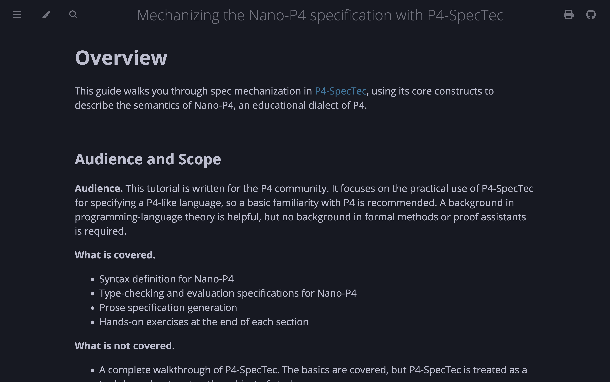
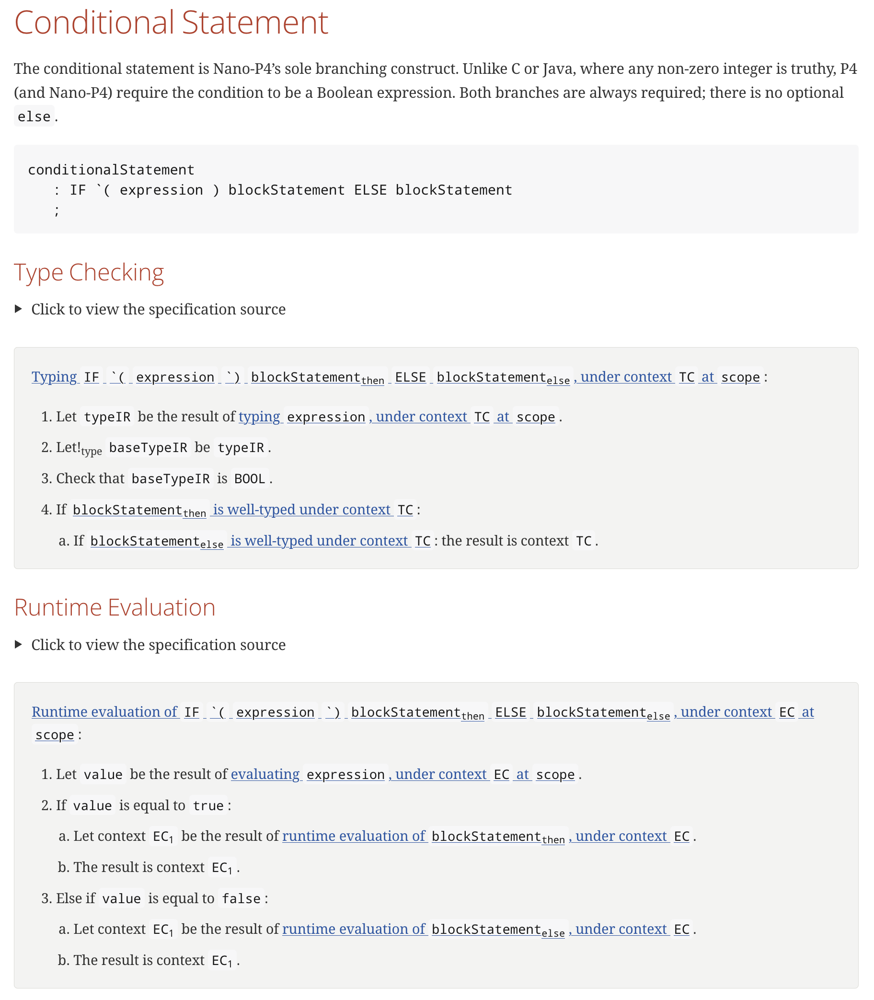

## Abstract

[P4-SpecTec](https://github.com/kaist-plrg/p4-spectec)[^1] is a mechanization
toolchain for the P4 programming language. It provides a domain-specific
language for writing formal specifications in the form of _algorithmic_
inference rules. In March 2026, P4-SpecTec was conditionally accepted by the P4
core team as the official language specification authoring toolchain for P4.
However, P4-SpecTec currently lacks accessible learning resources: new users
face a steep learning curve in understanding how to use the tool in practice.

This project addresses that gap with an end-to-end tutorial on utilizing
P4-SpecTec. It guides readers through writing a complete mechanized
specification from scratch, covering the toolchain basics, core semantic rules,
debugging techniques, and prose generation. The subject of the tutorial is
_Nano-P4_, an educational dialect of P4, whose mechanized specification is
developed alongside the text and serves as its running example.

Beyond the tutorial itself, the project also improves how accessible P4-SpecTec
is to newcomers: a Nix flake provides a fully reproducible development
environment for contributors, and an opam package distributes the `p4spectec`
binary to users who want to install it without building from source.

## Implementation Details

### Nano-P4 Mechanized Specification

Relevant PRs:

- [kaist-plrg/p4-spectec#170: Static semantics](https://github.com/kaist-plrg/p4-spectec/pull/170)
- [kaist-plrg/p4-spectec#177: Dynamic semantics](https://github.com/kaist-plrg/p4-spectec/pull/177)

The Nano-P4 specification lives in the
[`pacokwon/nano-p4-spec`](https://github.com/pacokwon/nano-p4-spec) repository
as a collection of spec files, organized by phase and mirroring the structure of
the full P4 spec. The `nano-p4spectec` CLI that runs the spec is implemented in
[`p4spec/bin/nano.ml`](https://github.com/kaist-plrg/p4-spectec/blob/gsoc-nano-spec/p4spec/bin/nano.ml)
in the
[`kaist-plrg/p4-spectec`](https://github.com/kaist-plrg/p4-spectec/tree/gsoc-nano-spec)
repository (on the `gsoc-nano-spec` branch), where the spec is included as a
submodule.

**Syntax and IR:** The surface grammar of Nano-P4 is defined in
`1-syntax.watsup` as P4-SpecTec `syntax` definitions.

**Static semantics:** The static semantics defines what it means for a Nano-P4
program to be _well-typed_. The `5.xx-typing-*.watsup` files define
type-checking relations for every syntactic category. The top-level `Program_ok`
relation orchestrates the full type-checking pass; if it succeeds, it produces a
`typingContext` capturing type definitions, as well as the types of identifiers
and callables.

**Loading phase:** The loading phase sits between type checking and evaluation.
While the `typingContext` records the type of each callable, it does not retain
the callable's body; that information is discarded after type checking. The
loading phase (defined in `7.0-load-context.watsup` and
`7.1-load-declaration.watsup`) walks the declarations a second time to build a
`loadContext` that pairs each callable with its body and records the entry-point
parser and control for the NanoSwitch architecture.

**Dynamic semantics:** The dynamic semantics defines what it means for a Nano-P4
program to _run_. The `8.xx-eval-*.watsup` files define evaluation relations,
following the same structure as the static semantics. Each file covers a
syntactic category and contains inference rules that describe how they are
evaluated. The top-level `NanoSwitch_sim` relation models the NanoSwitch
architecture end to end: it runs the parser block on an input packet, then the
control block, and produces an output packet.

**Test suite:** The test suite has two kinds of test programs. Positive cases
are well-typed `.p4` files that double as both static and dynamic tests. The
static test verifies that the `Program_ok` relation accepts the program. The
dynamic test executes the `NanoSwitch_sim` rule with an accompanying `.stf`
file. Negative cases are plain `.p4` files that the type checker should reject;
no `.stf` is involved.

### Tutorial

The tutorial is organized into seven chapters, starting from first principles to
a working prose document:

1. **P4-SpecTec:** introduces the toolchain: installation, the core language
   constructs, the execution model, and the standard library.

2. **Nano-P4:** establishes what Nano-P4 is and what it covers: scope, syntax
   definitions written in P4-SpecTec, and the NanoSwitch architecture model.

3. **Static Semantics:** walks through the entire typing rules section by
   section: the typing context, type equality, expressions, l-values,
   statements, parameters, arguments, declarations, parser blocks, control
   blocks, and tables. Each section explains the design choices behind the
   rules. Exercises ask the reader to debug a broken spec, or fill in missing
   pieces in the spec.

4. **Loading Phase:** explains why a loading phase is necessary and walks
   through the load context and the declaration-loading rules.

5. **Dynamic Semantics:** mirrors the static semantics chapter in structure,
   covering evaluation context, values, expressions, statements, calls, calling
   convention, parser, control, and tables. Exercises similar to those in
   Chapter 3 can be found here.

6. **Tips for Debugging:** a practical chapter on how to debug a failing spec:
   reading error traces, inspecting values at each step, inserting `debug`
   premises to narrow down failures, and navigating the spec to find
   pattern-matching gaps. Includes two fully worked examples that walk from a
   failing run to a root cause and fix.

7. **Generating Prose Specification:** demonstrates the _prose_ backend: writing
   a skeleton AsciiDoc document with directive placeholders, running
   `nano-p4spectec splice` to fill them in from the spec, and compiling the
   result with Asciidoctor. Shows how `prose_in`, `prose_out`, `prose_true`, and
   `prose_false` hints on relation definitions control the quality of the
   generated English.

### Toolchain Availability

Relevant PRs:

- [kaist-plrg/p4-spectec#164](https://github.com/kaist-plrg/p4-spectec/pull/164)
- [ocaml/opam-repository#30455](https://github.com/ocaml/opam-repository/pull/30455)

**Nix flake:** A
[`flake.nix`](https://github.com/kaist-plrg/p4-spectec/blob/main/flake.nix) was
added to `kaist-plrg/p4-spectec`, pinning all build and runtime dependencies.
Running `nix develop` drops into a shell with OCaml, opam, and every required
library already present. This gives contributors the option to create a fully
reproducible development environment with a single command.

**opam package:**
[`p4spectec`](https://opam.ocaml.org/packages/p4spectec/p4spectec.0.1.2/) is now
published on the opam repository as version `0.1.2`. Users who already have opam
can install the binary with `opam install p4spectec`, without cloning the source
or managing the build themselves.

## Demo

### Reading the tutorial

The deployed book is live at:
**<https://kaist-plrg.github.io/nano-p4-tutorial>**

<p align="center">
  
  Tutorial overview page
</p>

### Following the tutorial hands-on

To run `nano-p4spectec` against the specification as you read, install the
toolchain as described in
[Chapter 1: Installation](https://kaist-plrg.github.io/nano-p4-tutorial/spectec/installation.html).
The `p4-spectec`
[repository](https://github.com/kaist-plrg/p4-spectec/tree/gsoc-nano-spec) also
ships a Nix flake for a fully reproducible setup.

With all dependencies installed, build `nano-p4spectec`:

```sh
git clone https://github.com/kaist-plrg/p4-spectec
cd p4-spectec
git checkout gsoc-nano-spec
nix develop  # or: install dependencies manually
make release
```

### Building the book locally

To build and serve the book locally, clone the tutorial repository and use its
Nix flake (which pins `mdbook` and `cargo`) or install them manually:

```sh
git clone https://github.com/kaist-plrg/nano-p4-tutorial
cd nano-p4-tutorial
nix develop  # or: install mdbook and cargo manually
make serve
```

Then open `http://localhost:3000` in a browser.

### Executing the specification

To type-check a Nano-P4 program:

```sh
./nano-p4spectec check nano-p4/spec -i nano-p4/include -p nano-p4/testdata/positive/free-pass.p4
```

A well-typed program prints `pass`. A type error prints a rule-trace tree
identifying the failing relation and source location.

```sh
$ ./nano-p4spectec check nano-p4/spec -i nano-p4/include -p nano-p4/testdata/positive/free-pass.p4
passed
```

To run the interpreter on a packet:

```sh
$ ./nano-p4spectec eval nano-p4/spec -i nano-p4/include -p nano-p4/testdata/positive/free-pass.p4 -stf nano-p4/testdata/positive/free-pass.stf
[PASS] Transmitted (0) 00
passed
```

### Generating prose documentation

To generate prose from the conditional statement skeleton:

```sh
./nano-p4spectec splice nano-p4/spec \
  -splice nano-p4/docs/sections-skeleton/conditional-statement.adoc \
  -out out/conditional-statement.adoc
asciidoctor -o out/conditional-statement.html out/conditional-statement.adoc
```

<p align="center">
  
  Rendered prose specification for the conditional statement
</p>

## Results

- A complete mechanized specification for Nano-P4 in P4-SpecTec, covering
  syntax, static semantics, a loading phase, and dynamic semantics.
- A seven-chapter mdBook tutorial published at
  [kaist-plrg.github.io/nano-p4-tutorial](https://kaist-plrg.github.io/nano-p4-tutorial),
  covering P4-SpecTec basics, the full Nano-P4 mechanization, debugging
  techniques, and prose generation, with hands-on exercises throughout.
- Reproducible development environments for P4-SpecTec via a Nix flake (pinned
  in the tutorial repository) and an opam package (distributed with
  `kaist-plrg/p4-spectec`).

## Future Work

**P4-SpecTec language reference:** The tutorial is designed to introduce
P4-SpecTec constructs as they are needed to write the Nano-P4 spec, not as a
systematic reference. A dedicated P4-SpecTec language reference document, one
that covers all constructs, syntax forms, and built-in functions in a
lookup-friendly format, would complement the tutorial well.

**Open-ended exercises:** The current exercises are closely guided: the reader
is told what is missing and roughly where to look. A natural next step is
open-ended exercises where the reader is given a feature description and must
figure out the spec changes themselves. Adding a validity bit to header types is
one good candidate: it touches the IR definitions, type checking, and
evaluation, requires the reader to think about where validity is checked and how
it propagates.

[^1]: [P4-SpecTec: A Mechanized Specification for P4 (Lee et al., 2026)](https://arxiv.org/abs/2608.00639)
