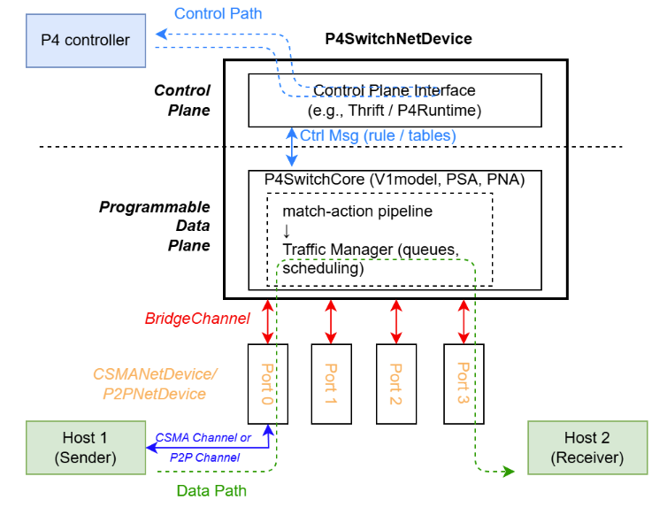
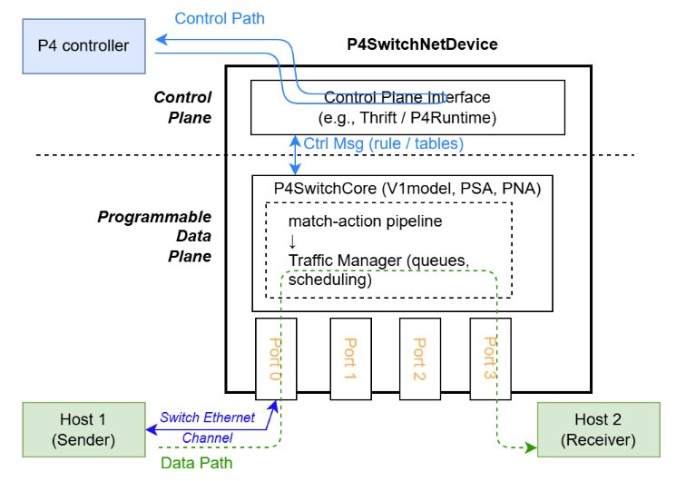

## Abstract

This project reworks the switch datapath of **P4Sim**, the P4 switch module for the ns-3
network simulator. Before this work, packets reached the channel through an extra port layer,
switch links reused the generic CSMA/P2P channel models, and the queues were drained by a timer
that polled them regardless of port state. The result was an indirect datapath and a scheduler
that did not track when a port was actually free to send.

The work addresses this in three parts. First, it **simplifies the switch–channel
architecture** by removing the intermediate port layer. Second, it uses a **more realistic
Ethernet channel** in place of the older CSMA/P2P channels. Third, it replaces the old
**polling-based scheduler** with an **event-driven scheduler** built on a Virtual Output Queue
(VOQ) structure. Together these give P4Sim a cleaner, more direct datapath and a more realistic
model of switch queueing.

## Goals

- Simplify the switch–channel architecture and make the data path more direct.
- Use a more realistic Ethernet channel for switch links.
- Replace polling-based scheduling with an event-driven scheduler backed by VOQ.

## What We Changed

1. **Simplified Switch–Channel Architecture** ([PR #22](https://github.com/HapCommSys/p4sim/pull/22))
   - Removed the intermediate **port layer**.
   - The switch NetDevice now connects **directly to the channel** to send and receive packets.
   - This gives a cleaner architecture and a more direct data path, with fewer hops between the
     switch pipeline and the wire.

2. **More Realistic Ethernet Channel** ([PR #22](https://github.com/HapCommSys/p4sim/pull/22); earlier channel work in [PR #20](https://github.com/HapCommSys/p4sim/pull/20) and [PR #21](https://github.com/HapCommSys/p4sim/pull/21))
   - Replaced the separate **CSMA/P2P channels** with a single **Ethernet channel**.
   - This better matches how Ethernet switches are actually connected, so the model behaves
     more like real switch-to-switch and switch-to-host links.

3. **Event-Driven Scheduling with VOQ** ([PR #25](https://github.com/HapCommSys/p4sim/pull/25), [PR #26](https://github.com/HapCommSys/p4sim/pull/26), [PR #27](https://github.com/HapCommSys/p4sim/pull/27), [PR #28](https://github.com/HapCommSys/p4sim/pull/28))
   - Replaced the **polling-based scheduler** with a **port-status-driven** one.
   - Scheduling now runs **when an output port becomes idle** (signalled by the port finishing a
     transmission), instead of polling the queues on a timer. This avoids wasted timer wake-ups
     and matches how hardware reacts to port availability.
   - The queues use a **Virtual Output Queue (VOQ)** structure — traffic is separated per output
     port — which is more realistic, scales better, and keeps congestion on one port from
     blocking traffic bound for another.

## Links

All code from this GSoC project lives in the following repository:
https://github.com/HapCommSys/p4sim

## Architecture

### Before



In the old design, the switch reached the channel through an intermediate **port layer**, links
used the separate **CSMA/P2P channels**, and scheduling was **polling-based** — the scheduler
checked the queues on a timer instead of reacting to port state.

### After



In the new design, the **port layer is gone** and the switch NetDevice connects **directly to
the channel**. Links use a single **Ethernet channel**, and scheduling is **event-driven**: it
runs **when an output port becomes idle** and is backed by a **VOQ** structure. The
switch–channel refactor landed in [PR #22](https://github.com/HapCommSys/p4sim/pull/22), and the
event-driven VOQ scheduling in [PR #25](https://github.com/HapCommSys/p4sim/pull/25)–[PR #28](https://github.com/HapCommSys/p4sim/pull/28).

## Examples and Tests

The new datapath is checked by a unit suite and a set of example scenarios.

| Scenario | Metric | Result |
| --- | --- | --- |
| Unit suite | test cases | 9 / 9 PASS |
| Conservation / parity | rxBytes / tmReceived / VoqEnqueued / Transmitted / tmDropped | 296000 / 298 / 298 / 298 / 0 |
| Throughput benchmark | achieved line rate (100M / 1G) | 97.13% / 97.09% |
| Strict-priority QoS | HIGH-priority flow kept under load | 95.92% |
| DDoS mitigation | legitimate flow kept (without isolation → with isolation) | 69.86% → 96.04% |

- **Unit suite** — covers enqueue/dequeue, VOQ behaviour, and event-driven scheduling, 9/9
  passing ([PR #25](https://github.com/HapCommSys/p4sim/pull/25), [PR #26](https://github.com/HapCommSys/p4sim/pull/26)).
- **Conservation / parity** (`p4-voq-fabric-integration`) — sends a known byte count through the
  switch and checks the ingress and egress totals match, with no unexplained loss
  (`tmDropped = 0`) ([PR #28](https://github.com/HapCommSys/p4sim/pull/28)).
- **Throughput benchmark** (`p4-voq-fabric-throughput`) — drives the datapath near line rate and
  reports the achieved rate at 100M and 1G ([PR #29](https://github.com/HapCommSys/p4sim/pull/29)).
- **Strict-priority QoS** (`p4-voq-fabric-priority`) — a HIGH and a LOW flow share one egress
  port; the HIGH flow is protected while the LOW flow is throttled ([PR #29](https://github.com/HapCommSys/p4sim/pull/29)).
- **DDoS mitigation** (`p4-voq-fabric-ddos`) — one legitimate flow against a flood of attacker
  flows, with a `--mitigate` flag that turns on per-priority buffer isolation. Without isolation
  the legitimate flow keeps ~70%; with isolation it keeps ~96%
  ([branch `examples/ddos-mitigation`](https://github.com/Vineet1101/P4Simulator/tree/examples/ddos-mitigation)).

To run an example:

```bash
./ns3 run contrib/p4sim/examples/p4-voq-fabric-throughput
```

## Future Work

- The Ethernet channel currently models switch links at the link level (data rate and
  propagation delay); adding configurable error/loss models would broaden the range of
  conditions P4Sim can reproduce.
- The event-driven scheduler currently supports strict-priority scheduling; adding further
  policies (for example weighted fair queueing) would let P4Sim model a wider set of QoS
  behaviours.
- The VOQ datapath is exercised through the V1model architecture; extending it to the PSA and
  PNA pipelines is a natural follow-up.

## References

- ns-3 network simulator — https://www.nsnam.org/
- ns-3 model library (CSMA and point-to-point channel models) — https://www.nsnam.org/docs/models/html/
- P4 language consortium — https://p4.org/
- P4 behavioral model (bmv2) — https://github.com/p4lang/behavioral-model
- P4Sim project repository — https://github.com/HapCommSys/p4sim
- DDoS-mitigation example branch — https://github.com/Vineet1101/P4Simulator/tree/examples/ddos-mitigation
