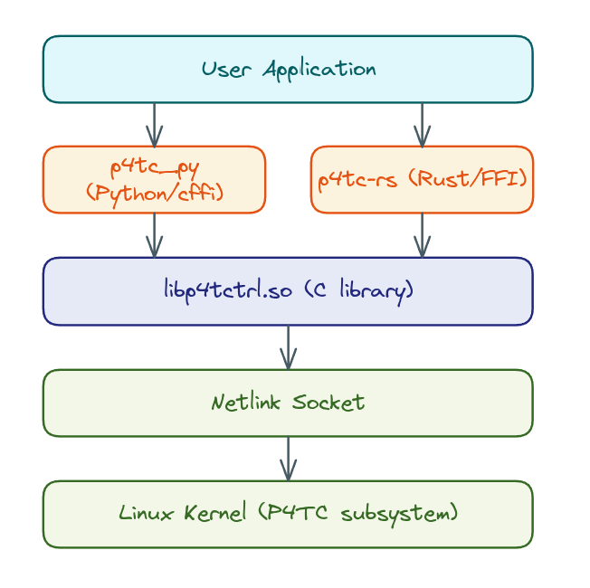

## Abstract

[P4 Traffic Control (P4TC)](https://p4tc.dev) is a Linux kernel subsystem that
runs P4 programs in the networking data path - either in software via eBPF, or
offloaded to hardware like SmartNICs. Its userspace runtime API (`libp4tctrl`)
is a C library that requires manual memory management, pointer arithmetic, and
raw byte handling.

This project built complete, high-level API wrappers in Python and Rust that let
developers manage P4 objects (tables, externs) and event subscriptions using
native language idioms. Both wrappers handle object allocation/deallocation,
callback bridging, response parsing, and schema-driven type decoding - exposing
a clean, idiomatic API in each language.

## Architecture



Both wrappers sit between user code and the C library (`libp4tctrl`). Python
uses `cffi` with `dlopen` for FFI; Rust uses `bindgen` with a `sys` crate. Each
wrapper translates high-level calls into the C API's object lifecycle
(create, configure, execute, destroy) and parses kernel responses back into
native data types.

## Repositories

| Repo | Language |
|------|----------|
| [p4tc-py](https://github.com/atta-ullah01/p4tc-py) | Python |
| [p4tc-rs](https://github.com/atta-ullah01/p4tc-rs) | Rust |

Both repositories are self-contained - each includes source, examples,
documentation, tests, and a bundled test pipeline (`register.tgz`).

## Before / After

What used to take ~8 lines of C with manual object lifecycle management now
takes 1-3 lines in Python or Rust:

**C (before):**
```c
struct p4tc_obj *obj = p4tc_obj_create("register", P4TC_OBJ_TABLE);
p4tc_obj_objname_set(obj, "ingress/nh_table");
struct p4tc_key *key = p4tc_make_key(obj, 1, (const char*[]){"10.0.0.1"});
struct p4tc_runt_tbl_attrs *entry = p4tc_alloc_tbl_entry(obj, key, 0, 0);
p4tc_create_runt_act(entry, "ingress/send_nh", 3,
    (const char*[]){"eth0", "00:aa:bb:cc:dd:ee", "00:11:22:33:44:55"});
p4tc_create(ctx, obj, 0, NULL, NULL);
p4tc_obj_destroy(obj);
```

**Python (after):**
```python
ctx.create("register", "ingress/nh_table",
           key=["10.0.0.1"],
           action=("ingress/send_nh", ["eth0", "00:aa:bb:cc:dd:ee", "00:11:22:33:44:55"]))
```

**Rust (after):**
```rust
ctx.create("register", "ingress/nh_table")
    .key("10.0.0.1")
    .action("ingress/send_nh")
    .params(&["eth0", "00:aa:bb:cc:dd:ee", "00:11:22:33:44:55"])
    .execute()?;
```

The API is identical in both languages by design - if you know one, you know
the other.

## Features

Both wrappers provide identical functionality:

| Feature | Description |
|---------|-------------|
| **Pipeline Provisioning** | Load a P4 pipeline from the kernel's template system. Parses the compiler-generated JSON schema for type information. |
| **Context Management** | Create netlink transport contexts for kernel communication. Python supports `with` statements; Rust uses `Drop`. |
| **Object CRUD** | `create`, `get`, `update`, `delete`, `dump`, `flush` - full lifecycle management of P4 runtime objects. |
| **Extern Operations** | `extern_update` and `extern_get` for P4 externs (e.g., Registers). |
| **Event Subscriptions** | `subscribe` to receive real-time notifications on P4 object changes via background callbacks. |
| **Schema-Driven Decoding** | Automatically decode raw kernel bytes into typed values (IPv4, IPv6, MAC, integers) using the P4 compiler's JSON schema. |
| **Error Handling** | Structured error hierarchy with errno propagation from the kernel. |

### Schema-Driven Type Decoding

One of the most impactful features. Without it, callbacks receive raw binary:
```
key: {'raw': b'\x0a\x00\x00\x01'}
param: b'\x00\xaa\xbb\xcc\xdd\xee'
```

With schema decoding enabled:
```
key: {'dstAddr': '10.0.0.1'}
param: srcMac = '00:aa:bb:cc:dd:ee'
```

The schema parser reads the P4 compiler's JSON output and maps field names,
types, and byte offsets to automatically convert key bytes and action parameters
in all callbacks (`get`, `dump`, `subscribe`).

### Event Subscriptions

```python
# Python
def on_event(entries, phase):
    for entry in entries:
        print(f"  event: phase={phase.name}, table={entry.table_name}, "
              f"key={entry.key}")

sub = ctx.subscribe("register", "ingress/nh_table", callback=on_event)
sub.start()
# ... CRUD on same context triggers callbacks ...
sub.stop()
```

```rust
// Rust
let mut sub = ctx.subscribe(PIPE, TABLE, move |entries, phase| {
    for entry in entries {
        println!("  event: phase={:?}, table={}, key={:?}",
                 phase, entry.table_name(), entry.key());
    }
}).expect("subscribe failed");
// ... CRUD on same context triggers callbacks ...
sub.stop();
```

## Upstream Contributions

Work on the wrappers drove improvements to `libp4tctrl` itself, coordinated
with my mentors:

| Issue | Resolution |
|-------|------------|
| C11 `_Generic` macros made FFI impossible | Upstream replaced macros with typed function variants |
| No programmatic getters (only `p4tc_obj_dump` to stdout) | Upstream added 30+ accessor functions |
| Extern API required dummy params for get operations | Upstream changed to accept `n_params=0, params=NULL` |
| Subscribe socket contention with CRUD on shared context | Upstream fix `43a46dcf1bb0` |

All upstream changes are in the `p4tc-tutorial` repository, branch `gsoc_2026`.

## Challenges

1. **FFI Closure Bridging** - The C library's strict 8-byte cookie alignment
   silently skipped Rust callbacks at unaligned stack addresses. Python uses
   `ffi.NULL` for cookie; Rust uses a `Box<u64>` cookie pointing to a
   heap-allocated closure.

2. **C11 `_Generic` Macros** - Neither cffi nor bindgen can handle compile-time
   type dispatch. Required an upstream API change before FFI binding was
   possible.

3. **Missing Programmatic Getters** - 30+ getter functions had to be added
   upstream to enable proper response types (`TableEntry`, `Action`, `Param`,
   `ExternEntry`).

4. **Subscription Architecture (3 iterations)** - Went from a blocking loop, to
   separate contexts, to a single-context design after the mentor's upstream fix
   revealed that `p4tc_subscribe_resp_handle` spawns an internal thread.

5. **Type Decoding from Raw Bytes** - Mapping raw `void*` buffers to typed
   values using the P4 compiler's JSON schema. Getting byte order, padding, and
   bitfield extraction right across IPv4, IPv6, MAC addresses, and
   variable-width integers was the trickiest implementation challenge.

## Future Work

I plan to continue maintaining both wrappers after GSoC. Planned improvements:

- **New API coverage** - support new `libp4tctrl` features as they are added
- **CI/CD** - automated testing against the P4TC VM
- **Upstream bug fixes** - follow up on reported issues and integrate fixes

## References
- P4 Traffic Control (P4TC) — https://p4tc.dev/
- P4 language consortium — https://p4.org/
- P4TC: P4 Traffic Control — EuroP4 2023 paper — https://dl.acm.org/doi/10.1145/3630047.3630193
- P4TC kernel datapath — https://github.com/p4tc-dev/linux-p4tc-pub
- P4TC iproute2 — https://github.com/p4tc-dev/iproute2-p4tc-pub
- P4TC tutorial — https://github.com/p4tc-dev/p4tc-tutorial-pub
- P4TC examples — https://github.com/p4tc-dev/p4tc-examples-pub
- Full GSoC final report — https://gist.github.com/atta-ullah01/86b98954265817c62e27bccae89d5fd6
